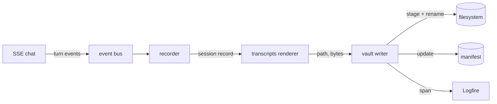

# Architecture: persistence and vault-write primitives

## Overview

Phase 1 adds the first persistence layer to the assistant. Completed and cancelled chat turns are rendered to markdown under `vault/transcripts/{date}/{session}.md` at session end. The phase also stands up the vault-write primitives (manifest, staging, provenance markers, single-writer serialization) that every later phase will reuse for any vault write. The chat loop itself is unchanged from init beyond emitting turn events.

## Components

**`app/chat/loop.py`** (existing, modified). Emits turn-start, turn-stream, turn-end, and cancellation events to an in-process event bus. No persistence logic lives here.

**`app/persistence/recorder.py`** (new). Subscribes to the event bus, buffers the active turn per session, and on session end (clean close or disconnect) hands the session record to the transcripts renderer. Owns the session lifecycle.

**`app/persistence/transcripts.py`** (new). Renders a session record into the transcript markdown body plus frontmatter. No I/O of its own. Returns a `(path, bytes)` pair to the vault writer.

**`app/persistence/vault/`** (new, reusable from phase 2 onward):

- `paths.py`: resolves vault paths from config and enforces the vault root.
- `manifest.py`: loads and saves the manifest. Provides hash lookup and write-skip checks.
- `writer.py`: single-writer `asyncio.Lock`, staging-then-rename, manifest update. Emits a Logfire span per write.
- `provenance.py`: provenance markers (`^[inferred]`, `^[ambiguous]`) and `provenance:` frontmatter ratios. Unused at phase 1; defined here so phase 3 inherits the shape without redesign.

## Data flow



1. User connects to the SSE chat endpoint. The loop creates a session (id, started_at, model).
2. Each turn emits turn-start, then turn-stream chunks, then turn-end (or cancellation on disconnect).
3. Recorder buffers turn events keyed by session.
4. On session close (clean or cancelled), recorder calls the transcripts renderer with the full session record.
5. Renderer produces frontmatter and body, returns the target path and serialized bytes.
6. Writer acquires the vault lock, computes SHA-256 of the bytes, checks the manifest. If the hash matches what is already on disk, the write is skipped. Otherwise, the writer writes to `.staging/{session}.md.tmp`, fsyncs, renames into place, updates the manifest, and releases the lock.
7. The write emits a Logfire span: path, size, latency, manifest hit-or-miss.

## Storage layout

```
vault/
  transcripts/
    2026-05-22/
      2026-05-22T143012-a3f8k9.md
      2026-05-22T151245-b9d2x1.md
  .manifest/
    transcripts.json
  .staging/
```

- `transcripts/{YYYY-MM-DD}/{session}.md`: one file per session.
- `.manifest/transcripts.json`: `{ session_id: { path, sha256, written_at, status } }`. Dot-prefixed so Obsidian hides it by default.
- `.staging/`: transient files during atomic rename. Swept on startup.

### Transcript file format

```md
---
session_id: 2026-05-22T143012-a3f8k9
started_at: 2026-05-22T14:30:12.482Z
ended_at:   2026-05-22T14:34:01.119Z
model: openai:gpt-4o-mini
status: completed   # or: cancelled
turn_count: 4
---

## turn 1

**user**

What's on my calendar tomorrow?

**assistant**

[response text]
```

Cancellation: the turn during which the disconnect occurred ends with a `[cancelled]` marker line. Partial streamed tokens are preserved up to the point of disconnect.

## Run

No deploy surface at this phase. Run locally:

```
uv run uvicorn app.main:app --reload
```

Config (`pydantic-settings`, `.env`):

- `VAULT_ROOT`: absolute path to the vault.
- `MODEL`: pydantic-ai model string, default `openai:gpt-4o-mini`.
- `LOGFIRE_TOKEN`: already set at init.

## Operations

- **Logs.** Logfire spans for every chat turn and every vault write (path, size, latency, manifest hit or miss). No new log surface at this phase.
- **Restart.** Plain process restart. Sessions in flight at shutdown are lost unless the disconnect handler ran first. The staging directory is swept on startup; any leftover `.tmp` files are deleted.
- **Common failures.**
  - *Disk full or permission errors.* Write fails, the writer logs and re-raises. Session is lost. Acceptable at phase 1.
  - *Manifest corruption.* The manifest is a cache, not a source of truth. On load failure, rebuild by scanning `transcripts/` and hashing each file.
  - *Vault path missing.* Fail fast at startup with a clear error.

## Key decisions

- **ADR-006: manifest format.** JSON, single file at `vault/.manifest/transcripts.json`. SQLite rejected as overkill for one user, single process. Markdown table rejected as inconvenient for programmatic updates.
- **ADR-007: session id scheme.** `{ISO8601 timestamp}-{6-char base32 nonce}`. Sortable, readable, stdlib-only. UUID4 rejected as needlessly opaque.
- **ADR-008: transcript markdown layout.** YAML frontmatter plus `## turn N` headings. Frontmatter keys (`session_id`, `started_at`, `ended_at`, `model`, `status`, `turn_count`) are namespaced away from Skills-spec keys per I6.
- **ADR-009: vault-write coordination.** Single in-process `asyncio.Lock` in the vault writer. All vault writes from any later phase go through this lock. Multi-process coordination is out of scope until a phase needs it.

## What this enables for later phases

- Phase 2 (semantic recall) reads transcripts as the corpus.
- Phase 3 (declarative memory) writes through the same vault writer, inheriting staging, atomic rename, and the lock.
- Phase 8 (skill drafter) writes draft skills through the same writer. The provenance markers defined here become live.
