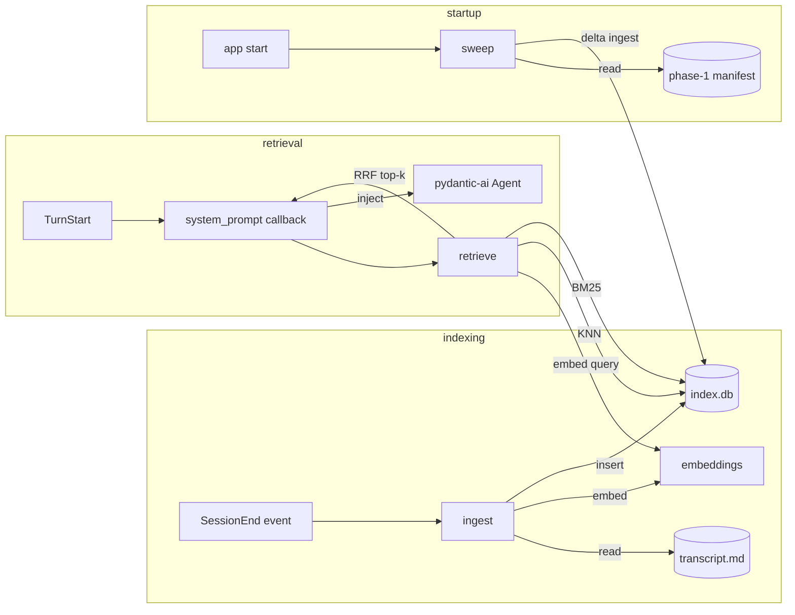

# Architecture: semantic recall and hybrid retrieval

## Overview

Phase 2 adds a hybrid retrieval layer over completed transcripts. Each chunk is one full turn (user message plus assistant response), embedded and lexically indexed. On every new turn, top-k relevant past exchanges are retrieved from across prior sessions and injected into the system prompt for that turn only. Indexing is event-driven: an `ingest` subscriber listens for the phase-1 `SessionEnd` event and indexes the new transcript after the session closes. A startup sweep reconciles the index against the phase-1 manifest so transcripts written while the indexer was down are caught.

## Components

**`app/recall/index.py`** (new). Owns the SQLite connection, schema migrations, and table layout. A single `index.db` lives outside the vault at the configured `INDEX_ROOT`. A `_meta` table tracks schema version.

**`app/recall/chunker.py`** (new). Parses a transcript markdown file into chunks. One chunk per turn (user message plus the assistant response that followed). Skips turns marked `[cancelled]` only if the assistant content is empty; partial-but-non-empty cancelled turns are still indexed.

**`app/recall/embeddings.py`** (new). Provider-agnostic embeddings wrapper. Accepts a model string like `openai:text-embedding-3-small` and exposes `embed(texts: list[str]) -> list[list[float]]`. The single point of provider knowledge for embeddings (I9). App code never imports a provider SDK directly.

**`app/recall/ingest.py`** (new). Subscribes to `SessionEnd`. On event: loads the transcript via phase-1 paths, chunks it, embeds each chunk, and writes all three indexes (vector, lexical, metadata) in a single SQLite transaction. Marks the transcript as ingested.

**`app/recall/retrieve.py`** (new). Pre-turn retrieval. Embeds the query, runs sqlite-vec KNN, runs FTS5 BM25, fuses with reciprocal rank fusion, returns top-k chunks with citations.

**`app/recall/sweep.py`** (new). Startup delta sweep. Reads the phase-1 manifest, reads the `ingestions` table, indexes any transcripts missing from the index. Runs synchronously at startup before the chat endpoint accepts connections.

**`app/chat/loop.py`** (existing, modified). Adds a pydantic-ai `@agent.system_prompt` callback. The callback receives `RunContext` carrying the current user message, calls `retrieve.retrieve`, and returns the rendered recall context as a system-prompt fragment for that turn only.

**`app/main.py`** (existing, modified). At startup: open `index.db`, run schema migrations, run `sweep`, subscribe `ingest` to the event bus. At shutdown: close the SQLite connection so WAL flushes cleanly.

## Data flow



Indexing happens after `SessionEnd`, never during a turn. Retrieval happens at the start of every turn via a pydantic-ai system-prompt callback, so the injection lifecycle is the framework's, not ours. Both paths share the embeddings module so the model choice is centralized.

## Storage layout

```
{INDEX_ROOT}/
  index.db
```

`INDEX_ROOT` defaults to an OS-appropriate user data directory (e.g., `~/.local/share/assistant/index/`). Single SQLite database, four tables:

- `chunks`: id (pk), transcript_path, session_id, turn_number, user_text, assistant_text, content (user + assistant concatenated for FTS), started_at, ended_at, cancelled (bool), embedding_model (string).
- `chunks_vec`: sqlite-vec virtual table, vector embedding per chunk, keyed by chunk id.
- `chunks_fts`: FTS5 virtual table over `content`.
- `ingestions`: transcript_path (pk), transcript_sha256, indexed_at, embedding_model. The indexer's view of which manifest entries are absorbed.

`chunks`, `chunks_vec`, and `chunks_fts` are kept in sync by inserting into all three within a single transaction during ingest. No triggers; the application controls writes.

The `embedding_model` columns on `chunks` and `ingestions` exist so a model change is detectable: chunks embedded with model A are in a different vector space than those embedded with model B. Mixing them silently breaks retrieval. See operations below.

## Retrieval

Each user turn triggers:

1. Embed the query via `embeddings.embed([user_message])`.
2. Run sqlite-vec KNN with `LIMIT 4 * k`.
3. Run FTS5 BM25 with `LIMIT 4 * k`.
4. Fuse with reciprocal rank fusion: `score(d) = Σ over each result list L of 1 / (RRF_K + rank_L(d))`. The constant defaults to 60 (literature default); no tuning at phase 2.
5. Sort by fused score, take top-k.
6. Filter out chunks from the current session (the query session does not retrieve itself).
7. Return chunks with citations: `transcript_path`, `turn_number`, `started_at`.

The system-prompt callback renders the retrieved chunks into the system prompt for the current turn only. Format:

````md
## Recall context (n past exchanges)

### from {date} ({transcript_path}#turn-N)

**user**

{user_text}

**assistant**

{assistant_text}

### from ...
````

Citations are transcript paths plus turn numbers so the assistant can be asked to refer back to a specific past exchange, and so a future tool in phase 6+ can fetch the full transcript by path.

If retrieval returns zero chunks (empty index, query has no matches above any threshold, or retrieval failed and degraded), the callback returns an empty string and the system prompt for that turn has no recall section.

## Run

No new deploy surface. Run locally:

```
uv run uvicorn app.main:app --reload
```

New config (`pydantic-settings`, `.env`):

- `INDEX_ROOT`: directory for `index.db`. Defaults to an OS-appropriate user data directory.
- `EMBEDDING_MODEL`: provider-prefixed model string. Default `openai:text-embedding-3-small`.
- `RECALL_TOP_K`: integer. Default 5.
- `RECALL_RRF_K`: integer. Default 60. Exposed as a tuning hook; do not tune at phase 2.

A small CLI subcommand exposes the index state for inspection: `assistant index status` prints chunk count, transcript count, gaps against the manifest, and the embedding model in use.

## Operations

- **Logs.** Logfire spans for every retrieval (query length, k, BM25 rank scores, vec distances, fused scores, latency) and every ingestion (transcript path, chunk count, embedding tokens, latency). Schema migrations and sweep operations emit their own spans.
- **Restart.** Plain process restart. The startup sweep catches any transcripts written between shutdown and restart. SQLite's WAL is flushed on clean shutdown; on dirty shutdown WAL recovery handles it on next open.
- **Common failures.**
  - *Embedding provider down or rate-limited.* Ingestion retries with exponential backoff; on persistent failure, leaves the transcript unindexed and logs the gap. Retrieval degrades to BM25-only and logs.
  - *sqlite-vec extension not loaded.* Fail fast at startup with a clear error pointing to install instructions.
  - *Schema migration needed.* `index.py` runs idempotent migrations against `_meta.schema_version` on every startup. If a migration fails, refuse to start; the operator decides whether to rebuild.
  - *Embedding model changed.* Detected at startup by comparing `EMBEDDING_MODEL` to the most recent value in `ingestions`. On mismatch, fail fast and instruct the operator to run `assistant index rebuild` (drop chunks and chunks_vec, run `sweep` against the full manifest with the new model). Mixing vector spaces silently is worse than failing loudly.
  - *Corrupt index.db.* The index is a cache; manifest plus transcripts are the source of truth. `assistant index rebuild` drops and rebuilds.

## Key decisions

- **ADR-010: index backend.** sqlite-vec, not chromadb. SQLite FTS5 is the right BM25 (incremental updates, persistent, no extra `rank_bm25` dependency). With SQLite required for FTS5, sqlite-vec is one storage system instead of two, with single-transaction atomicity across both indexes. chromadb would have meant either a second SQLite alongside it for FTS5, or accepting `rank_bm25`'s rebuild-from-scratch cost on every session end.
- **ADR-011: hybrid scoring.** Reciprocal rank fusion at constant 60. Linear combination requires tuning a weight; RRF requires nothing and survives unit-mismatched score scales (BM25 vs cosine distance). Revisit if phase-5 evals show recall left on the table.
- **ADR-012: chunking unit.** One chunk per turn (user message plus assistant response, concatenated). Per-topic clustering and sliding-window chunking deferred; the brief's non-goals list both.
- **ADR-013: embedding model.** `openai:text-embedding-3-small` at 1536 dimensions. Cheap (estimated well under one cent per 1000 chat-typical chunks), well-supported, swappable via config. Local models considered and deferred until cost or privacy demands them.
- **ADR-014: index update mechanism.** Event-driven on `SessionEnd` plus a startup delta sweep against the phase-1 manifest. Polling rejected as needlessly stale; the event bus is already there.

## What this enables for later phases

- Phase 3 (declarative memory): the schema shape and provider-agnostic embeddings interface generalize. Phase 3 likely stands up a parallel `memory.db` with the same shape rather than mixing transcript chunks and memory facts in one table.
- Phase 5 (evals): the Recall@k, MRR, and faithfulness fixtures land against `retrieve` and `ingest` directly; the eval harness wraps them.
- Phase 6 / Phase 7 (tools): a `vault_search` tool wraps `retrieve.retrieve` with looser parameters (no session exclusion, higher k, no auto-inject). Same code path.
- Phase 8 (skill drafter): the chunking pattern (read a vault artifact, embed, index) carries over to skill discovery if needed, though phase 4 description-matching is the primary skill-load mechanism.
