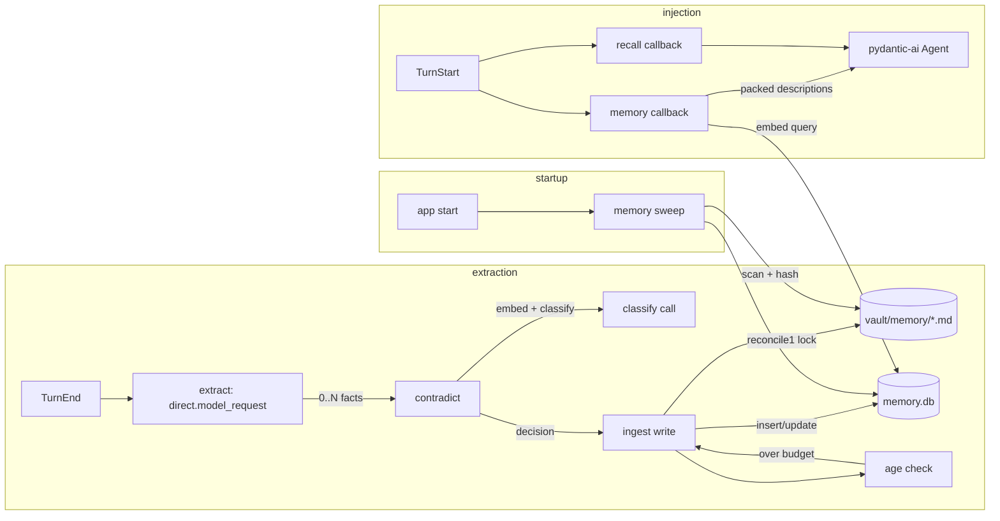

# Architecture: declarative memory

## Overview

Phase 3 adds durable, Skills-spec-formatted memory entries under `vault/memory/`. After every completed turn, a background extractor runs `direct.model_request` against the user message and assistant response, produces zero or more typed facts, and writes them to the vault. Each new fact passes through contradiction detection against existing entries via embedding similarity, with a classifier call resolving ambiguous cases. The chat loop's system-prompt assembly gains a second callback that injects the hot tier of memory descriptions (Skills-spec tier-1 content) at every turn, packed under a token budget. A separate `memory.db` stores the index for both hot-tier ranking and cold-tier retrieval (body-on-match when a cold entry is relevant). Aging runs after each ingest: when the hot tier exceeds the budget, the least-recently-referenced hot entry demotes to cold.

This is the first phase where a background writer exercises the phase-1 vault lock concurrently with the chat path. The lock contract from ADR-009 is now load-bearing.

## Components

**`app/memory/index.py`** (new). SQLite database for memory, parallel to the recall index. Owns the connection, the sqlite-vec extension load, the schema, and migrations. Lives at `{INDEX_ROOT}/memory.db` by default; override with `MEMORY_DB_PATH`.

**`app/memory/extract.py`** (new). Background fact extraction. Subscribes to `TurnEnd` events from the phase-1 bus. On each event: calls `direct.model_request` with the extraction prompt and the typed `ExtractedFacts` response model. Returns zero or more `ExtractedFact` records. Non-blocking from the chat-loop perspective; runs as a background asyncio task.

**`app/memory/contradict.py`** (new). Given a candidate fact, embeds the description, queries `entries_vec` for the top-k nearest existing entries, and for each with cosine similarity above `MEMORY_CONTRADICT_THRESHOLD` (default 0.85), runs `direct.model_request` with a classification prompt: contradiction, update, or unrelated. Returns a resolution decision.

**`app/memory/ingest.py`** (new). Orchestrates the extract, contradict, write, and age pipeline for each candidate fact. Acquires the phase-1 vault lock for the write portion only; embedding and `direct.model_request` calls happen outside the lock so chat-path writes are not delayed by network latency.

**`app/memory/age.py`** (new). Aging logic. After every successful ingest: sums hot-tier description tokens; if over budget, demotes the entry with the oldest `last_referenced_at` (tie-break on `created_at`) by setting `metadata.tier: cold` and rewriting the file. Loops until under budget.

**`app/memory/inject.py`** (new). Hot-tier system-prompt callback. For each turn: embeds the current user message, queries the memory index for relevance-ranked hot descriptions, packs into the system prompt up to `MEMORY_HOT_TOKENS` (default 1000). Always-include any entry with `metadata.always: true`. Updates `last_referenced_at` for entries it injects.

**`app/memory/retrieve.py`** (new). Cold-tier retrieval. Same shape as `app/recall/retrieve.py` but targets `memory.db` and the cold subset. Used by future phases (phase 7's tool surface); not invoked from the chat loop in phase 3. Stub now so phase 6+ can adopt it without redesign.

**`app/memory/sweep.py`** (new). Startup sweep. Scans `vault/memory/` for markdown files, hashes each, compares to `entries.content_hash` in the index. Indexes new or changed files; removes orphan rows for files no longer on disk. Refuses to run if `EMBEDDING_MODEL` differs from `_meta.last_embedding_model` (same fail-fast policy as the recall sweep).

**`app/chat/loop.py`** (existing, modified). Adds a second pydantic-ai `@agent.system_prompt` callback that calls `memory.inject.render(...)` and returns the hot-tier fragment. Order in the final system prompt: base prompt, memory hot tier, recall context (phase 2).

**`app/main.py`** (existing, modified). At startup: open `memory.db`, run `memory.sweep`, register `memory.extract` as the `TurnEnd` subscriber. At shutdown: close the memory connection.

## Data flow



Extraction is non-blocking: `TurnEnd` returns immediately; the background task does the LLM call, contradiction check, write, and aging. A crash mid-extraction drops the fact; the next sweep reconciles the index against the vault but does not re-extract from past turns.

## Storage layout

```
vault/memory/
  {name}.md
  {name}.md
  ...
```

```
{INDEX_ROOT}/
  index.db        (phase 2)
  memory.db       (phase 3)
```

Each memory file follows the Skills-spec frontmatter per I6:

```md
---
name: operators-manager
description: Operator's manager is Kin Chau (he/him), a former peer who took over the role from Mark.
metadata:
  created_at: 2026-05-22T14:30:12Z
  last_updated_at: 2026-05-22T14:30:12Z
  last_referenced_at: 2026-05-22T14:30:12Z
  source_session: 2026-05-22T143012-a3f8k9
  source_turn: 3
  tier: hot
  always: false
  supersedes: null
  supersedes_by: null
  confidence: 0.95
  provenance: stated
  embedding_model: openai:text-embedding-3-small
---

[Body: extended context, supersession history, longer-form provenance notes.]
```

`name` doubles as the filename slug (lowercase, hyphenated). Skills-spec top-level keys (`name`, `description`) are reserved; all phase-3 fields ride under `metadata.*` per the spec's client-key escape hatch.

`memory.db` schema:

- `_meta`: schema_version, last_embedding_model.
- `entries`: entry_id (pk), name (unique), file_path, description, body, created_at, last_updated_at, last_referenced_at, source_session, source_turn, tier (hot or cold), always (bool), supersedes (entry_id or null), supersedes_by (entry_id or null), confidence, provenance (stated, inferred, or ambiguous), embedding_model, content_hash.
- `entries_vec`: sqlite-vec virtual table, description embedding per entry.
- `entries_fts`: FTS5 over `description`.

Aging operates on `entries.tier` and rewrites the corresponding file's `metadata.tier`. Both must change in lockstep; the ingest path treats the pair as a single logical operation covered by the phase-1 vault lock.

## Extraction

The extraction prompt is the load-bearing artifact in this phase. The architecture commits to:

- One `direct.model_request` per `TurnEnd`, taking the user message and the assistant response as context.
- Returns a typed pydantic model carrying a list of `ExtractedFact` records. Each fact has `name` (slug, lowercase, hyphenated), `description` (the fact statement, target under 30 tokens), `body` (optional extended context), `confidence` (0 to 1), `provenance` (stated, inferred, or ambiguous), and `always` (bool, default false).
- Empty list when the turn produces no durable facts. Most turns will produce empty lists.
- Prompt constraints: durable facts only (not transient state like "I'm having coffee"); about the operator (preferences, attributes, relationships, ongoing work); no inferred sensitive attributes the operator did not state.
- Provenance is the model's own judgment about its source: `stated` means the operator said it directly, `inferred` means the model concluded it from context, `ambiguous` means the model is unsure.

The exact prompt text is captured in ADR-020. It is the most-tunable artifact and will be revised once phase 5 evals expose its failure modes.

## Contradiction handling

When a new fact arrives at the ingest step:

1. Embed the candidate description via the phase-2 embeddings wrapper.
2. Query `entries_vec` for the 5 nearest existing entries by cosine distance.
3. Filter to candidates with cosine similarity above `MEMORY_CONTRADICT_THRESHOLD` (default 0.85). If none, write the new fact as a fresh entry.
4. For each remaining candidate: `direct.model_request` with a classification prompt presenting the existing entry and the new candidate. The model returns one of: `contradiction`, `update`, `unrelated`.
5. On `contradiction` or `update`: mark the old entry as superseded by writing `metadata.supersedes_by: {new-entry-name}` to its file and setting `entries.supersedes_by` in the index. Write the new entry with `metadata.supersedes: {old-entry-name}`, a body note citing the source turn that triggered the supersession, and `tier: hot`. The old entry's tier moves to cold (it still ranks for retrieval but no longer competes for the hot budget).
6. On `unrelated`: write the new fact as a fresh entry; the two coexist.

Both files remain on disk after supersession. The supersession history is auditable; the operator can read what was believed and when.

The 0.85 threshold is a starting point. Phase 5 evals will pressure-test it; the constant is exposed as `MEMORY_CONTRADICT_THRESHOLD` for tuning without code change.

## Injection

The chat loop registers two `@agent.system_prompt` callbacks. pydantic-ai stacks them in registration order. Final system prompt:

1. Base system prompt (from init).
2. Memory hot tier (this phase).
3. Recall context (phase 2).

The memory callback's per-turn algorithm:

1. Embed the current user message via the phase-2 embeddings wrapper.
2. Query `entries_vec` for the top `4 * (budget / avg_description_tokens)` hot descriptions by relevance (this gives the packer headroom).
3. Always-include any entry with `metadata.always: true`, regardless of relevance score.
4. Pack descriptions greedily: highest relevance first; stop when adding the next would exceed `MEMORY_HOT_TOKENS`.
5. Render as a system-prompt fragment:

````md
## Operator memory

- Operator's manager is Kin Chau (he/him), a former peer who took over the role from Mark.
- Operator prefers concise and direct responses, with code only when explicitly requested.
- ...
````

6. Update `last_referenced_at` on every injected entry. This write goes through the phase-1 vault lock (for the file) and the memory index (for the row), batched as a single async task at the end of the turn so injection latency is not paid synchronously.

Empty hot tier returns empty string; the system prompt has no memory section.

## Aging

After every successful ingest:

1. Sum hot-tier description tokens. Token counts are computed once at write and stored in the index to avoid recomputing on every aging pass.
2. If under `MEMORY_HOT_TOKENS`, done.
3. Otherwise: find the hot entry with the oldest `last_referenced_at` (tie-break: oldest `created_at`). Skip entries with `metadata.always: true`.
4. Demote: set `entries.tier = cold` and rewrite `metadata.tier: cold` in the file. Single transaction across both stores via the vault lock.
5. Loop from step 1.

No auto-promotion from cold to hot. The operator can promote manually via the CLI. Auto-promotion adds churn for one-off references; deferred.

`metadata.always: true` is a permanent escape hatch. Entries flagged always stay hot regardless of budget; the budget can be exceeded if always-entries alone exceed it (with a logged warning). The operator sets this flag, never the agent.

## Run

No new deploy surface. Run locally:

```
uv run uvicorn app.main:app --reload
```

New config (`pydantic-settings`, `.env`):

- `MEMORY_DB_PATH`: override path for the memory database. Default: `{INDEX_ROOT}/memory.db`.
- `MEMORY_HOT_TOKENS`: integer token budget for the hot tier. Default 1000.
- `MEMORY_CONTRADICT_THRESHOLD`: cosine similarity for contradiction candidacy. Default 0.85.
- `EXTRACTION_MODEL`: pydantic-ai model string for extraction and contradiction-classification calls. Default `openai:gpt-4o-mini`.

`EMBEDDING_MODEL` from phase 2 is reused for memory embeddings.

New CLI surface (extends the `assistant` CLI):

- `assistant memory status`: list entries by tier; show current hot-tier token usage; show counts for cold and superseded.
- `assistant memory show {name}`: print a memory entry's frontmatter and body.
- `assistant memory promote {name}`: cold to hot.
- `assistant memory demote {name}`: hot to cold.
- `assistant memory rebalance`: re-run aging against current state.
- `assistant memory rebuild`: drop and rebuild the index from `vault/memory/` files (parallel to `assistant index rebuild`).

## Operations

- **Logs.** Logfire spans for every extraction call (model, input tokens, output tokens, fact count, latency), every contradiction classification (similarity score, decision, latency), every memory write (path, size, latency), and every injection (entries considered, entries packed, token count, latency).
- **Restart.** Plain process restart. The startup sweep reconciles the index against the vault. In-flight extraction tasks are abandoned on shutdown; the next session does not re-extract from past turns.
- **Common failures.**
  - *Extraction model call fails.* Background task logs and exits. The fact is lost.
  - *Vault write fails after extraction succeeded.* Log; the fact is lost. The index is not updated.
  - *Contradiction embedding or classify call fails.* Skip contradiction detection, write the new fact as a fresh entry, log the degradation.
  - *Memory file corrupted by operator editing.* Sweep logs the parse error, removes the orphan row from the index, leaves the file alone for the operator to fix.
  - *Embedding model changed.* Same fail-fast policy as the recall sweep: refuse to start, instruct the operator to run `assistant memory rebuild`.
  - *Concurrent writes from extraction and the phase-1 transcript writer.* The phase-1 lock serializes; one waits. Phase-3 writes are single files and brief.

## Key decisions

- **ADR-015: memory index placement.** Parallel `memory.db` at `{INDEX_ROOT}/memory.db`, not a namespace inside `index.db`. Memory and transcripts have different lifecycles (memory mutates, transcripts are append-only), different schemas, and independent rebuild semantics. One concession: two SQLite connections to manage instead of one.
- **ADR-016: tier organization on disk.** Single folder (`vault/memory/`) with `metadata.tier` in frontmatter. Two folders would require path changes on every aging operation, propagating through `entries.file_path` and any supersession pointers. Metadata-only aging keeps paths stable.
- **ADR-017: aging policy.** LRU eviction at budget overrun; hot to cold only; no auto-promotion. Aging runs after every ingest, not on a timer. Operator promotes manually via the CLI when a cold entry deserves to return.
- **ADR-018: contradiction handling.** Cosine threshold 0.85 to nominate candidates; `direct.model_request` classifies as contradiction, update, or unrelated. Superseded entries stay on disk with pointers to their successor; both records are auditable.
- **ADR-019: injection order.** Base system prompt, then memory hot tier, then recall context. Two separate `@agent.system_prompt` callbacks. Memory carries operator framing (longer-lived); recall carries turn-specific context. Memory first matches that priority.
- **ADR-020: extraction trigger and scope.** One `direct.model_request` call per `TurnEnd`, running as a background asyncio task. The call sees the user message and the assistant response. Returns 0 to N typed facts. `direct.model_request` keeps the call outside the chat Agent per I9 and ADR-001.
- **ADR-021: always-loaded entries.** `metadata.always: true` is an escape hatch for facts the operator wants permanently in the hot tier regardless of budget. Set by the operator only, never by the agent. Tracks the cline Memory Bank convention for procedural always-loaded content.

## What this enables for later phases

- Phase 4 (skills): Skills-spec format is now exercised end-to-end. Phase 4 adds the second Skills-spec-formatted entry type (skills) and a description-driven injection mechanism that mirrors memory injection's relevance + budget pattern.
- Phase 5 (evals): planted-fact, contradiction-resolution, token-budget, and aging fixtures become eval-harness scenarios. The extraction prompt is the most-tunable surface; ADR-020 will be revisited.
- Phase 7 (tools): a `memory_search` tool wraps `memory.retrieve` with looser parameters (no tier filter, higher k). Same code path.
- Phase 8 (skill drafter): the extraction pattern (background `direct.model_request` producing typed records, writing through the vault lock) carries over directly. Skill drafting is extraction over traces; memory extraction is extraction over turns.
