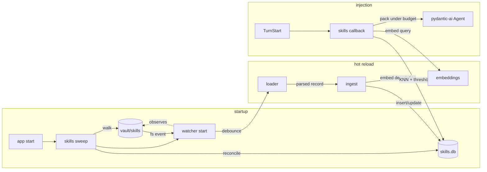

# Architecture: skills catalog with description-driven matching

## Overview

Phase 4 adds a curated catalog of procedural skills at `vault/skills/`. Each skill is a Skills-spec markdown record: a top-level `name` and `description` (which is the matching surface), application-specific fields under `metadata.*`, and a body holding the procedural content. Skills are matched to each incoming user turn by embedding similarity between the turn and the skill descriptions; matched bodies are packed into the system prompt under `SKILL_BUDGET`. The catalog reloads on disk changes via a `watchdog` observer, with a polling fallback for filesystems that don't support change events. A startup sweep reconciles the index with the vault before chat accepts connections.

Skills are author-curated at this phase. The agent will write skills in phase 8, using the same store; `metadata.source` reserves the slot. The references and scripts subdirectories described by the Anthropic Agent Skills spec exist on disk now but are not loaded by app code, because the agent has no tools to invoke them; phases 6 and 7 will wire that path.

This phase introduces the first long-lived background subscriber that watches the vault directly rather than the event bus.

## Components

**`app/skills/index.py`** (new). SQLite database for skills at `{INDEX_ROOT}/skills.db`. Parallel to `index.db` and `memory.db`. Owns the connection, the sqlite-vec extension load, the schema, and migrations.

**`app/skills/loader.py`** (new). Discovers and parses skill files. Walks `vault/skills/` returning a record per skill regardless of single-file or directory layout. Parses Skills-spec frontmatter; validates required fields; surfaces structured warnings on parse failures without raising.

**`app/skills/ingest.py`** (new). Given one parsed skill record, embeds the description via the phase-2 embeddings wrapper, computes a content hash, and writes to `skills.db` in a single transaction. Idempotent: re-ingesting a skill whose content hash matches the existing row is a no-op.

**`app/skills/sweep.py`** (new). Startup reconciliation. Walks the vault, hashes each skill, compares to `skills.content_hash`. Inserts new, updates changed, removes orphan rows. Refuses to run on embedding-model mismatch (same fail-fast policy as the recall and memory sweeps).

**`app/skills/watcher.py`** (new). A `watchdog`-based observer subscribed to `vault/skills/`. Routes filesystem events (created, modified, deleted, moved) through a debouncer to the ingest path or to a delete handler. Falls back to a polling sweep every `SKILL_POLL_INTERVAL` if the OS or filesystem reports no native event backend.

**`app/skills/match.py`** (new). Per-turn matching. Embeds the user turn, runs sqlite-vec KNN over `skills_vec`, applies the `SKILL_MATCH_THRESHOLD` filter, optionally augments with an FTS5 query, sorts, and returns ranked candidates.

**`app/skills/pack.py`** (new). Greedy packer. Given ranked candidates and a budget, returns the subset whose bodies fit. Honors `metadata.priority` for tie-breaking and `metadata.always` for unconditional inclusion (escape hatch parallel to memory).

**`app/skills/inject.py`** (new). The `@agent.system_prompt` callback. Calls match, then pack, then renders the system-prompt fragment. Updates `last_referenced_at` for injected skills in a background task post-turn.

**`app/chat/loop.py`** (existing, modified). Registers the skills callback. Order of the three callbacks is fixed at registration time per ADR-024.

**`app/main.py`** (existing, modified). At startup: open `skills.db`, run sweep, start the watcher. At shutdown: stop the watcher cleanly and close the database.

## Data flow



Three separate `@agent.system_prompt` callbacks are now registered, in this order:

1. Memory hot tier (phase 3).
2. Skills (this phase).
3. Recall context (phase 2).

The rationale lives in ADR-024: memory frames who the operator is and persists across all contexts; skills frame how to handle this kind of task; recall frames what was specifically said before. General to procedural to specific.

## Storage layout

### Vault

```
vault/skills/
  quick-reply.md
  code-review.md
  dossier-build/
    SKILL.md
    references/
      bsky-author-patterns.md
    scripts/
      collect-thread.py
```

Both layouts coexist. The loader normalizes them into the same record shape.

Frontmatter for a typical skill:

```md
---
name: code-review
description: Review a code diff for correctness, style, and potential bugs, returning a prioritized findings list.
metadata:
  source: user-written
  created_at: 2026-05-22T14:30:12Z
  last_updated_at: 2026-05-22T14:30:12Z
  last_referenced_at: 2026-05-22T14:30:12Z
  priority: 0
  always: false
  tags:
    - code
    - review
  embedding_model: openai:text-embedding-3-small
---

[Body: numbered steps the model should follow when this skill matches.
References subdirectory holds longer style guides; the body cites them by
relative path. The agent cannot fetch them yet; phase 6 changes that.]
```

`name` doubles as the slug and matches either the filename (single-file layout) or the parent directory name (multi-file layout). Skills-spec top-level keys (`name`, `description`) are reserved; phase-4 fields all ride under `metadata.*` per the spec's client-key escape hatch.

### Index

```
{INDEX_ROOT}/
  index.db      (phase 2)
  memory.db     (phase 3)
  skills.db     (phase 4)
```

`skills.db` schema:

- `_meta`: schema_version, last_embedding_model.
- `skills`: skill_id (pk autoincrement), name (unique, not null), file_path, layout (`file` or `directory`), description, body, body_tokens, description_tokens, created_at, last_updated_at, last_referenced_at, source (`user-written`, `agent-written`, `vendored`), priority (int), always (bool), tags (json array), embedding_model, content_hash.
- `skills_vec`: sqlite-vec virtual table; embedding of the description.
- `skills_fts`: FTS5 virtual table over `description` and `body`. The body is indexed so query terms can match content inside the body even when the description is general.

The `last_referenced_at` column mirrors the memory store's convention. It is not used for aging at phase 4 (skills are curated, the catalog stays small, and aging is unwarranted). It is exposed because phase 10 may use it as a signal for which skills are worth optimizing.

## Matching

Per turn:

1. Embed the user message via the phase-2 embeddings wrapper.
2. Run sqlite-vec KNN over `skills_vec` with `LIMIT 2 * (SKILL_BUDGET / avg_body_tokens)`. The factor gives the packer headroom.
3. Compute an FTS5 BM25 score over the same query against `skills_fts`. Combine scores via reciprocal rank fusion (ADR-011's pattern reused, constant 60).
4. Filter to candidates whose fused score corresponds to a cosine similarity above `SKILL_MATCH_THRESHOLD` (default 0.55; lower than memory's contradiction threshold because skills are deliberately abstract and meant to match broadly). The exact mapping from RRF score to a similarity-equivalent threshold is opaque; the architecture exposes the threshold as a tunable constant and the eval suite calibrates it.
5. Always-include any skill with `metadata.always: true`, regardless of score.
6. Sort by fused score descending; break ties by `metadata.priority` descending, then by name (stable).
7. Return the ranked candidate list.

If both branches fail (embeddings and FTS5), the skills section is skipped for the turn.

## Packing and injection

The packer takes the ranked candidate list and the budget:

1. Pop `always: true` skills first; reserve their body tokens against the budget.
2. Iterate the remaining ranked list. For each candidate: if `current_total + body_tokens <= SKILL_BUDGET`, include it; otherwise skip.
3. Stop when the candidate list is exhausted or the budget cannot fit any further item.
4. Return the packed subset in their original (similarity) order.

If always-skills alone exceed the budget, the packer logs a warning and includes them anyway. The operator chose them; the agent should not silently drop a flagged skill.

The render format:

````md
## Skills for this turn

### code-review

[Body of the matched skill, verbatim.]

### quick-reply

[Body of the matched skill, verbatim.]
````

The heading is fixed so the model learns its semantic role. Each subsection uses the skill's `name` as the heading.

`last_referenced_at` is updated for injected skills via a background task at end-of-turn, identical in shape to the memory injection pattern.

## Hot-reload

The watcher subscribes to `vault/skills/` with `watchdog`. Events of interest:

- `on_created`: a new skill file or directory. Loader parses; ingest writes a new row.
- `on_modified`: an existing skill's content changed. Loader re-parses; ingest updates the row (hash-check skips no-op writes).
- `on_deleted`: a skill file or directory disappeared. Delete handler removes the row from `skills`, `skills_vec`, `skills_fts`.
- `on_moved`: rename or relocation. Resolve as a delete plus create; the new path's `name` (filename or directory name) determines whether the rename is a `name` change or just a path change.

Debounce: events arriving within 500 ms for the same path collapse into one action. This protects against editor save patterns that fire multiple events per save (write temp, rename, chmod).

Polling fallback: if the watchdog observer fails to start (no kernel event backend, unsupported filesystem), the watcher logs the fallback and runs a polling sweep every `SKILL_POLL_INTERVAL` (default 10 seconds). The polling path uses the same sweep logic as startup: walk, hash, reconcile. Operators on remote filesystems (NFS, SSHFS) will experience this fallback.

Operations involving the embeddings call (every ingest) happen outside any vault lock; ingestion is read-only against the vault. Index writes are inside a single SQLite transaction per skill, not coordinated with phase-1's `asyncio.Lock` because no vault writes are issued by this phase.

## Run

No new deploy surface. Run locally:

```
uv run uvicorn app.main:app --reload
```

New config (`pydantic-settings`, `.env`):

- `SKILLS_DB_PATH`: override path. Default `{INDEX_ROOT}/skills.db`.
- `SKILL_BUDGET`: integer token budget. Default 2000.
- `SKILL_MATCH_THRESHOLD`: minimum fused score for a candidate to enter the packer. Default 0.55.
- `SKILL_POLL_INTERVAL`: seconds between polls when watchdog falls back. Default 10.

`EMBEDDING_MODEL` from phase 2 is reused.

New CLI surface:

- `assistant skills status`: list skills with name, source, priority, body tokens, last_referenced_at; total budget budget capacity used by `always` skills; current sweep state.
- `assistant skills show {name}`: print frontmatter and body.
- `assistant skills test {query}`: simulate matching for a query string; print the candidates with scores, thresholded filter, and packed result. Useful for tuning `SKILL_MATCH_THRESHOLD` against real queries.
- `assistant skills rebuild`: drop and rebuild the index from `vault/skills/`. Confirmation required unless `--yes`.

## Operations

- **Logs.** Logfire spans for every match (query length, candidates considered, filter cut, fused scores, latency); every ingest (skill name, body size, embedding tokens, latency); every hot-reload event (path, action, debounced); every sweep (counts).
- **Restart.** Sweep runs at startup before chat accepts connections. The watcher starts immediately after sweep. Any filesystem activity during the window between watcher start and sweep completion is captured by the watcher's queue (debounce buffer) and processed once sweep finishes.
- **Common failures.**
  - *Skill file unparseable.* Log structured warning; sweep skips it; the existing row stays in the index. The operator fixes the file; the next event re-ingests.
  - *Embedding provider down during ingest.* Retry with exponential backoff (3 attempts); if persistent, leave the index stale and log. Matching for that skill degrades to FTS5-only until the next successful ingest.
  - *Embedding provider down during matching.* Degrade to BM25-only over `skills_fts`; if both fail, skip the skills section for that turn.
  - *Watchdog fails to start.* Log; fall back to polling; the operator sees the fallback notice in startup logs.
  - *Concurrent edit.* Hash check detects the mutation; retry once with the new content; if still inconsistent, defer to the next event.
  - *Embedding model changed.* Same fail-fast policy as recall and memory; instruct the operator to run `assistant skills rebuild`.
  - *Body referenced subdirectory paths that don't exist.* Phase 4 does not load these, so the inconsistency is silent until phase 6 wires the tool. The skill still matches and injects normally. `assistant skills status` could surface dangling references as a later enhancement; phase 4 does not.

## Key decisions

- **ADR-022: skills store placement.** Parallel `skills.db` at `{INDEX_ROOT}/skills.db`. Three SQLite stores under `INDEX_ROOT` is the consistent pattern from phases 2 and 3. Lifecycles are distinct: skills are curated and have multi-file structure; memory is extracted and mutated; transcripts are append-only.
- **ADR-023: matching algorithm.** Hybrid: sqlite-vec KNN over description embeddings plus FTS5 over description and body, fused with RRF (constant 60, reusing ADR-011's pattern). Threshold-filtered (default 0.55). Pure-embedding rejected because skill descriptions are short and embedding similarity alone is brittle when the user's wording is highly literal. Adding FTS5 on description-plus-body catches keyword matches the embedding misses.
- **ADR-024: injection order in the system-prompt stack.** Memory, skills, recall. This supersedes ADR-019. Memory frames the operator (longest-lived); skills frame the task type (medium-lived, task-scoped); recall frames specific past exchanges (shortest-lived, query-specific). General to procedural to specific.
- **ADR-025: budget and packing.** Greedy pack by similarity descending with always-skills reserved first. Budget default 2000 tokens. The packer never silently truncates a body to fit; it either includes the whole body or skips the skill. Truncation deferred; revisit if phase-5 evals show frequently-dropped useful matches.
- **ADR-026: descriptions are not always-loaded.** Deviation from Anthropic Agent Skills tier-1 intent. The spec assumes the model decides when to invoke a skill from a visible catalog; this phase decides externally via embedding match and FTS5. Always-loading every description spends context budget that the external matcher does not need. Documented so phase-8 agent-written skills inherit the same model.
- **ADR-027: hot-reload mechanism.** `watchdog` observer over `vault/skills/` with 500 ms debounce. Polling fallback at `SKILL_POLL_INTERVAL` (default 10 s) when the OS or filesystem reports no native event backend.
- **ADR-028: references and scripts are present-but-deferred.** A skill's `references/` and `scripts/` subdirectories exist on disk and can be cited by relative path in the body. Phase 4 does not load them and does not validate them. Phase 6 (first tool) and phase 7 (multi-tool) will add tool surfaces that fetch them on demand. The skill body cites them by name; the agent invokes the tool to read them when the body's procedural steps point that way.

## What this enables for later phases

- **Phase 5 (evals).** Skill-match precision (Recall@k over labeled query-skill pairs) and skill-following adherence (rubric-based LLM-as-judge on responses produced under skill injection) become eval-harness scenarios. `SKILL_MATCH_THRESHOLD` is the tunable surface.
- **Phase 6 (first tool).** The first tool likely reads from `references/` or executes a `scripts/` entry. The skill's body cites the resource by relative path; the tool resolves it under the skill's directory.
- **Phase 7 (multi-tool).** The system prompt explicitly tells the Agent to consult skills before tool-calling (a skill that says "run script X" is preferred over the Agent autonomously inventing a tool plan). The skills callback is already in place.
- **Phase 8 (skill drafter).** The agent writes new skill files using the same Skills-spec format, the same vault layout, and the same store. `metadata.source: agent-written` distinguishes them; the watcher picks them up automatically through the same hot-reload path. The phase-1 vault writer's lock now serializes both the operator's edits (rare) and the agent's drafts (recurring).
- **Phase 10 (self-improvement).** GEPA-style optimization rewrites skill bodies in place. The watcher reloads them. The agent's behavior improves without code changes.
