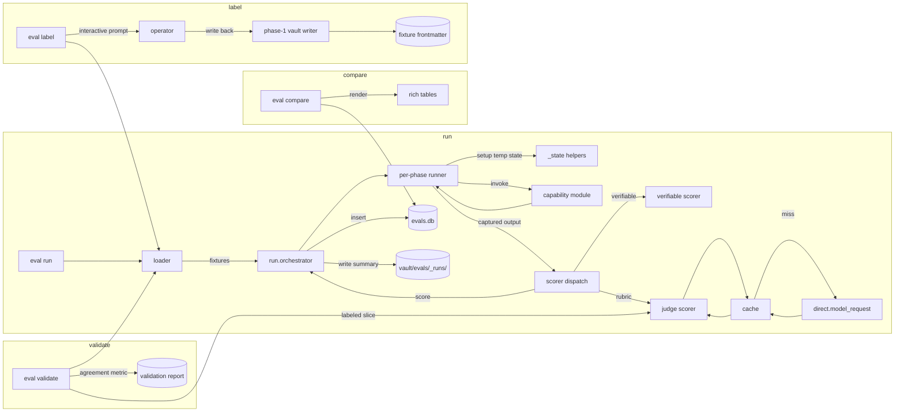

# Architecture: eval harness

## Overview

Phase 5 stands up a unified eval harness as a CLI (`assistant eval`) and a Python library. Fixtures live in `vault/evals/{phase}/{bucket}/*.md` with a typed frontmatter spec. Per-phase runners import the relevant capability modules and invoke them as functions with a fresh isolated environment per fixture. Scorers come in two flavors: verifiable (mechanical) and judge (LLM-as-judge with rubrics). Judge calls go through a diskcache keyed on (judge model, rubric content hash, input hash), so a repeated run costs zero LLM dollars when rubrics are stable. Results land in `evals.db` for query-able rollups and as committed markdown summaries under `vault/evals/_runs/{run_label}/summary.md` for git-trackable history.

Operator-labeled ground truth lives in the fixture frontmatter (`metadata.human_score`). A `label` subcommand walks rubric buckets and captures labels interactively. A `validate` subcommand computes judge-human agreement against labeled slices and reports per-bucket numbers.

The harness does not go through the FastAPI app. Capability modules are designed to be importable from phase 1 onward, and phase 5 exercises that design directly. Two exceptions where the full chat path is unavoidable (faithfulness rubric, skill-following rubric) drive a chat turn through the Agent by constructing the Agent in-process with overridden config.

## Components

**`app/evals/format.py`** (new). The fixture format spec as typed pydantic models. One model per fixture `type` (`VerifiableSingle`, `VerifiableStateful`, `RubricSingle`, `RubricMultiTurn`), all extending a common base with `phase`, `bucket`, `type`, `expected`, optional `human_score`, `human_reasoning`, `human_labeled_at`, `human_labeled_by`, optional `rubric_ref`. Body field for inline rubrics or procedural setup notes.

**`app/evals/loader.py`** (new). Walks `vault/evals/{phase}/{bucket}/` and parses each fixture file into the appropriate typed model. Validates required fields per type. Resolves `rubric_ref` against `vault/evals/_rubrics/`. Errors are returned, not raised; the caller decides whether to log and continue.

**`app/evals/store.py`** (new). SQLite at `{INDEX_ROOT}/evals.db`. Owns the connection, schema, migrations. Public API for inserting runs, recording fixture results, querying rollups, retrieving run histories.

**`app/evals/cache.py`** (new). Diskcache wrapper at `{INDEX_ROOT}/evals_cache/`. Keys on `sha256(judge_model || rubric_hash || input_hash)`. Public API: `get_or_compute(key, fn)` where `fn` is the async judge call. Cache hits log a Logfire span with `cached: true`; misses span with `cached: false` and capture the underlying judge model's span as a child.

**`app/evals/scorers/verifiable.py`** (new). Pure-Python comparison logic per fixture type. `score_verifiable_single(fixture, actual)` and `score_verifiable_stateful(fixture, post_state)`. Returns a `VerifiableScore` carrying a binary pass/fail (or a real-valued score for metrics like recall@k) and a structured reason.

**`app/evals/scorers/judge.py`** (new). LLM-as-judge. Loads the rubric (inline or via ref). Constructs the judge prompt from the rubric, the fixture input, and the actual capability output. Calls `direct.model_request` with a typed response model (`JudgeVerdict`: score, reasoning, confidence). Wraps the call in the diskcache. Returns a `JudgeScore`.

**`app/evals/scorers/__init__.py`** (new). Dispatch by fixture type: verifiable scorer for verifiable types, judge scorer for rubric types. A typed `ScoreResult` is the unified return.

**`app/evals/runners/`** (new directory). One module per phase: `phase1.py`, `phase2.py`, `phase3.py`, `phase4.py`. Each module exposes `runners`, a mapping from bucket name to an async function `run(fixture, config) -> CaptureResult`. The runner is responsible for: setting up isolated state (temp `INDEX_ROOT`, temp vault, seeded fixtures), importing the capability under test, invoking it, capturing the relevant output (system prompt fragment, retrieval result, post-state of memory store), tearing down. The runner does not score; it returns the captured output to the scorer.

**`app/evals/runners/_state.py`** (new). Common state-setup helpers: `temp_index_root()`, `seed_transcripts(records)`, `seed_memory(entries)`, `seed_skills(skills)`, `inprocess_agent(config_overrides)`. Used by runners across phases.

**`app/evals/run.py`** (new). The top-level orchestrator. Given a phase or bucket selector and a `RunConfig`, loads fixtures, dispatches to runners, calls scorers, writes results to the store, writes the human-readable summary to `vault/evals/_runs/{run_label}/summary.md`. Concurrency controlled by `--workers` (default 4 for verifiable, 2 for judge to keep API costs predictable).

**`app/evals/compare.py`** (new). Loads two runs from the store, computes per-fixture deltas and bucket rollup deltas, renders with `rich`. Tables and side-by-side panels; color-coded improvements vs regressions.

**`app/evals/label.py`** (new). Interactive labeling workflow. Walks a rubric bucket; for each fixture without a `human_score`, prompts the operator with the input and the rubric; captures the score and reasoning; writes back to the fixture frontmatter via the phase-1 vault writer. Re-labeling an existing score requires explicit confirmation.

**`app/evals/validate.py`** (new). Computes judge-human agreement against operator-labeled fixtures in a bucket. Runs the judge on the labeled slice (cache-hot from prior runs typically), compares `judge_score` to `human_score`, computes the agreement metric per ADR-035 (simple accuracy for binary rubrics, Cohen's quadratic-weighted kappa for ordinal, Spearman ρ for continuous). Renders a report and writes it to `vault/evals/_runs/{run_label}/validation/{bucket}.md`.

**`app/evals/cli.py`** (new). The `assistant eval` subcommand surface: `run`, `compare`, `validate`, `label`, `status`, `prune`. Each maps to a function in the modules above.

## Data flow



The orchestrator's hot path is short: load, dispatch to runner, score, persist. Runners hold all phase-specific knowledge.

## Fixture format

Skills-spec-style frontmatter, but the file itself is not a skill (no Skills-spec compliance required per I6; fixtures are not agent-readable instructions). Top-level `name` and `description` are reserved by convention; phase-5 fields ride under `metadata.*`.

### Verifiable single (one input, one expected output)

```md
---
name: recall-at-5-marie-curie
description: Query about Marie Curie should surface the chunk where Curie was discussed.
metadata:
  phase: 2
  bucket: recall-at-k
  type: verifiable_single
  expected:
    expected_chunk_id: 142
    k: 5
    score_kind: contains  # presence in top-k
---
```

### Verifiable stateful (setup + action + expected post-state)

```md
---
name: budget-evicts-oldest
description: Ingesting a fact that pushes the hot tier over budget evicts the oldest-referenced.
metadata:
  phase: 3
  bucket: budget-enforcement
  type: verifiable_stateful
  setup:
    memory_entries:
      - name: fact-1
        description: "fact one"
        last_referenced_at: 2026-05-20T10:00:00Z
        tier: hot
      - name: fact-2
        description: "fact two"
        last_referenced_at: 2026-05-22T10:00:00Z
        tier: hot
    config:
      MEMORY_HOT_TOKENS: 30
  action:
    kind: ingest_fact
    fact:
      name: fact-3
      description: "fact three a bit longer to push over budget"
  expected:
    hot_tier_names: [fact-2, fact-3]
    cold_tier_names: [fact-1]
---
```

### Rubric single (one input, one rubric, judge produces a score)

```md
---
name: faithfulness-grounded
description: Response is fully grounded in the retrieved context.
metadata:
  phase: 2
  bucket: faithfulness
  type: rubric_single
  rubric_ref: faithfulness-binary
  input:
    context_chunks:
      - "operator's manager is Kin Chau"
    response: "Your manager Kin Chau approved the budget."
  expected:
    score_kind: real  # judge returns real in [0, 1]
  human_score: 0.3
  human_reasoning: "Manager name correct; approval claim not in context."
  human_labeled_at: 2026-05-23T15:00:00Z
  human_labeled_by: scott
---
```

### Rubric multi-turn (a conversation transcript, one rubric)

```md
---
name: coherence-five-turns
description: A five-turn conversation about debugging an issue.
metadata:
  phase: 1
  bucket: multi-turn-coherence
  type: rubric_multi_turn
  rubric_ref: coherence-5pt
  input:
    transcript_path: vault/evals/phase-1/multi-turn-coherence/_fixtures/conversation-3.md
  expected:
    score_kind: ordinal  # judge returns integer 1..5
  human_score: 4
  human_reasoning: "Mostly coherent; turn 4 drops earlier context."
---
```

`metadata.rubric_ref` resolves against `vault/evals/_rubrics/{name}.md`. Rubric files carry their own frontmatter (`score_kind`, optional `scale`, optional `examples`) and a body that holds the rubric text shown to the judge.

## Per-phase runners

Each runner module exposes a `runners` dict from bucket name to a runner function. The runner function signature is `async def run(fixture: FixtureRecord, config: RunConfig) -> CaptureResult`.

A runner does three things:

1. Set up isolated state. The `_state` helpers provide `temp_index_root()` which creates a `tempfile.TemporaryDirectory` and sets the environment so the capability points at the temp directory. Seeding helpers populate the temp `INDEX_ROOT` and temp vault with the fixture's `setup` data.
2. Invoke the capability under test, passing config overrides if present.
3. Capture the relevant output. The shape of `CaptureResult` varies by bucket and is typed via a discriminated union; the scorer dispatches on the type.

### Phase 1 runners

- `persistence-roundtrip`: write a synthetic session through `app.persistence.recorder`, then re-parse the resulting transcript file; compare to the input.
- `cancellation-marker`: simulate a turn with a cancellation event, render through the recorder, assert the `[cancelled]` marker and frontmatter `status: cancelled`.
- `multi-turn-coherence`: load the referenced transcript file, hand the content to the judge with the coherence rubric.

### Phase 2 runners

- `recall-at-k`: seed a temp transcripts vault and a temp `index.db`; ingest the seeded transcripts via `app.recall.ingest`; call `app.recall.retrieve.retrieve(query, k)`; assert the expected chunk id appears in the returned list (and at what rank).
- `mrr`: same setup as recall-at-k; score is `1 / rank` of the expected chunk, or 0 if absent.
- `faithfulness`: full-chat path. Seed the temp index with the fixture's `input.context_chunks` as a single ad-hoc transcript. Construct an in-process pydantic-ai Agent with the same callbacks as production. Send the fixture's `input.response`-eliciting query through the Agent; capture the response. Hand the response and the context to the judge with the faithfulness rubric.

### Phase 3 runners

- `planted-fact-recall`: seed memory with the fixture's `setup.memory_entries`; call `app.memory.inject.render(query)` from the fixture; assert the rendered fragment contains expected substrings.
- `contradiction-resolution`: seed memory; invoke `app.memory.ingest.ingest_one(new_fact)`; assert the resulting state matches `expected` (supersedes pointers, tier assignments).
- `budget-enforcement`: seed memory; ingest the action's fact under the fixture's `config.MEMORY_HOT_TOKENS`; assert the resulting hot/cold split matches `expected`.
- `aging-correctness`: seed memory with `last_referenced_at` values; call `app.memory.age.check_and_evict()`; assert the resulting tier assignments.

### Phase 4 runners

- `skill-match-precision`: seed the skills catalog; call `app.skills.match.match(query)`; assert the expected skill name appears at position 1 (precision@1) and within the packed result (precision@budget).
- `skill-following-adherence`: full-chat path. Seed a single-skill catalog with the fixture's skill. Construct an in-process Agent. Send the fixture's query; capture the response. Hand the skill body and the response to the judge with the skill-following rubric.

The two full-chat runners (`faithfulness`, `skill-following`) are the only places the harness reaches through the Agent. They are slower and more expensive than the import-and-call runners; the run orchestrator throttles them to a lower worker count.

## Scoring

`scorers/verifiable.py` exposes one function per verifiable type, each returning a typed `VerifiableScore`. Comparisons are exact; floats use a small tolerance; lists compare order-sensitively unless the fixture's `expected.unordered` flag is set.

`scorers/judge.py` exposes a single async function `score_judge(fixture, captured)` that:

1. Resolves the rubric (inline body wins over `rubric_ref`).
2. Constructs the judge prompt: a system message containing the rubric text and the response-model schema; a user message with the fixture's input and the captured output.
3. Builds the cache key: `sha256(judge_model || rubric_text || serialize(fixture.input, captured))`.
4. `cache.get_or_compute(key, fn)` where `fn` runs `direct.model_request` with a typed `JudgeVerdict` response model.
5. Returns a `JudgeScore` (score, reasoning, confidence, cached).

The `JudgeVerdict` model:

```python
class JudgeVerdict(BaseModel):
    score: float | int  # type per rubric.score_kind
    reasoning: str
    confidence: float  # 0..1, judge's self-confidence
```

Rubric files specify `score_kind` in their frontmatter; the judge prompt template instantiates the response model schema accordingly.

## Results store

SQLite at `{INDEX_ROOT}/evals.db`. Not committed to git (per ADR-031); reproducible from fixtures plus capability code.

```sql
CREATE TABLE _meta (schema_version INTEGER NOT NULL);

CREATE TABLE runs (
  run_id INTEGER PRIMARY KEY,
  label TEXT NOT NULL,           -- human-supplied, unique per (label, started_at)
  started_at TEXT NOT NULL,
  ended_at TEXT,
  status TEXT NOT NULL,          -- running | completed | interrupted | failed
  config_snapshot TEXT NOT NULL, -- JSON
  git_sha TEXT,                  -- captured from `git rev-parse HEAD` at run start
  total_fixtures INTEGER,
  passed INTEGER,
  failed INTEGER,
  errored INTEGER,
  judge_calls INTEGER,
  judge_cache_hits INTEGER
);

CREATE TABLE fixture_results (
  result_id INTEGER PRIMARY KEY,
  run_id INTEGER NOT NULL REFERENCES runs(run_id),
  fixture_path TEXT NOT NULL,
  phase INTEGER NOT NULL,
  bucket TEXT NOT NULL,
  type TEXT NOT NULL,
  score REAL,           -- verifiable: 0 or 1 or real; judge: per rubric
  pass BOOLEAN,         -- verifiable: pass/fail; judge: thresholded per rubric
  human_score REAL,     -- copied from fixture at run time
  judge_reasoning TEXT,
  judge_confidence REAL,
  judge_model TEXT,
  rubric_hash TEXT,     -- per ADR-034
  latency_ms INTEGER,
  cost_usd REAL,        -- estimated from token counts
  cached BOOLEAN,
  error TEXT
);

CREATE INDEX idx_results_run ON fixture_results(run_id);
CREATE INDEX idx_results_bucket ON fixture_results(run_id, phase, bucket);
```

Rollups are computed at query time; the schema is small enough that on-the-fly aggregation is fine.

## Human-readable run summary

Every completed run writes `vault/evals/_runs/{label}/{run_id}/summary.md` through the phase-1 vault writer. Content:

- Frontmatter: `run_id`, `label`, `started_at`, `ended_at`, `git_sha`, `config_snapshot` summarized (full JSON path-link), `total_fixtures`, `passed`, `failed`, `errored`, `judge_calls`, `judge_cache_hits`.
- Body: rollup table per phase and bucket. Per-fixture rows only when failures or errors occurred (passing fixtures are summarized in the rollup). Errored rows include the error message.

This is the git-trackable artifact. The portfolio's history of eval runs lives in `vault/evals/_runs/`.

## Comparison

`assistant eval compare {run_label_a} {run_label_b}` loads both runs from `evals.db`, joins on `(phase, bucket, fixture_path)`, and renders:

- A bucket-rollup table: per (phase, bucket), pass-rate-a vs pass-rate-b, mean-score-a vs mean-score-b, delta, count-of-changed-fixtures.
- A per-fixture detail table: rows where the score changed by more than a configurable epsilon. Columns: fixture path, score-a, score-b, delta, judge-reasoning-a (excerpt), judge-reasoning-b (excerpt).
- Color: green for improvements, red for regressions, yellow for neutral changes.

Comparison is reflexive: `compare a b` and `compare b a` produce the same content with deltas reversed. The orientation is a function of the argument order.

## Label workflow

`assistant eval label --phase {n} --bucket {b}` walks the bucket's fixtures. For each fixture without `metadata.human_score`:

1. Print the fixture name, the rubric, and the input (the actual content the judge would see).
2. Prompt: "Score: ?" Accept input per the rubric's `score_kind` (integer for ordinal, float for continuous, 0/1 for binary).
3. Prompt: "Reasoning: ?" Accept free text.
4. Set `metadata.human_score`, `metadata.human_reasoning`, `metadata.human_labeled_at`, `metadata.human_labeled_by` (from `git config user.name` or `EVALS_LABELER` env var).
5. Rewrite the fixture file through the phase-1 vault writer.

A `--re-label` flag walks already-labeled fixtures, showing the existing label and prompting for overwrite confirmation.

The 30-50 examples per rubric guidance from phase 1 is the operator's target; the harness does not enforce it but `eval status` surfaces label coverage per bucket so the operator can see progress.

## Validation workflow

`assistant eval validate --phase {n} --bucket {b}` runs the judge against every labeled fixture in the bucket, then computes agreement.

Per ADR-035:

- Binary rubrics (`score_kind: binary`, scores ∈ {0, 1}): simple accuracy. Bonus: confusion matrix.
- Ordinal rubrics (`score_kind: ordinal`, scores ∈ small integer range): Cohen's quadratic-weighted kappa.
- Continuous rubrics (`score_kind: real`, scores ∈ [0, 1] or arbitrary float range): Spearman ρ on the ranked pairs, plus mean absolute error.

The agreement report goes to `vault/evals/_runs/{label}/{run_id}/validation/{phase}-{bucket}.md`. Disagreements above a threshold are listed in detail so the operator can inspect them (rubric ambiguity? judge model weakness? mislabeled fixture?).

A bucket with fewer than 30 labels triggers a warning: the agreement number is reported but the report carries a "wide error bars" note.

## Concurrency

The orchestrator runs fixtures in parallel via `asyncio.gather`-style fan-out, capped by `--workers`:

- Verifiable buckets: default 4 workers. Capability invocations are fast and CPU-light.
- Judge buckets: default 2 workers. Each may issue an API call; throttle to keep provider rate limits comfortable.
- Full-chat runners (faithfulness, skill-following): default 1 worker. Each runner constructs an Agent, which is slower; concurrency tradeoffs are not worth it at this scale.

The worker counts are CLI overrides (`--workers verifiable=4,judge=2,chat=1`). Defaults are conservative; the operator dials up for fast iteration.

## Run

No deploy surface. Run locally as a CLI:

```
uv run assistant eval run --phase 3
uv run assistant eval run --bucket recall-at-k --label baseline
uv run assistant eval run --bucket recall-at-k --label k7 --override RECALL_TOP_K=7
uv run assistant eval compare baseline k7
uv run assistant eval label --phase 2 --bucket faithfulness
uv run assistant eval validate --phase 2 --bucket faithfulness
uv run assistant eval status
uv run assistant eval prune --keep-last 20
```

New config (`pydantic-settings`, `.env`):

- `JUDGE_MODEL`: pydantic-ai model string for judge calls. Default `openai:gpt-4o-mini`.
- `EVALS_DB_PATH`: override path. Default `{INDEX_ROOT}/evals.db`.
- `EVALS_CACHE_PATH`: override path. Default `{INDEX_ROOT}/evals_cache/`.
- `EVALS_LABELER`: free-text name for the labeler. Default reads `git config user.name`.

## Operations

- **Logs.** Logfire spans for every run (overall span), every fixture (per-fixture span), every judge call (cache hit/miss, latency, cost), every label write. Run start/end spans include the full config snapshot.
- **Restart.** The harness is a CLI; restart means re-running. Interrupted runs are marked `interrupted` and excluded from rollups by default; `--include-interrupted` opts in.
- **Common failures.**
  - *Fixture parse error.* Logged, skipped, counted in `errored`. The fixture file stays on disk for the operator to fix.
  - *Capability raises.* Captured into `fixture_results.error`. The run continues.
  - *Judge fails after retry.* `judge_score: NULL`, `error: <message>`. Excluded from rollups.
  - *Cache invalidated unexpectedly.* Logged via the cache miss span. Operator inspects what changed (model, rubric content, or input).
  - *Concurrent eval runs.* The second process fails fast on the in-process lock. Operators see a clear error message.

## Key decisions

- **ADR-029: fixture format.** Skills-spec-style frontmatter with `name`, `description`, and `metadata.*`. Required `metadata.*`: `phase`, `bucket`, `type`, `expected`. Four `type`s: `verifiable_single`, `verifiable_stateful`, `rubric_single`, `rubric_multi_turn`. Optional `metadata.*`: `human_score`, `human_reasoning`, `human_labeled_at`, `human_labeled_by`, `rubric_ref`. Fixtures are not Skills-spec compliant per I6 (they are not agent-readable instructions); the format is conventionally similar for vault consistency.
- **ADR-030: results store.** SQLite at `{INDEX_ROOT}/evals.db`. Normalized: `runs` and `fixture_results` tables. Rollups computed at query time.
- **ADR-031: results in git.** `evals.db` is not committed. The human-readable per-run markdown summary at `vault/evals/_runs/{label}/{run_id}/summary.md` is committed and is the git-trackable history.
- **ADR-032: scorer architecture.** Two scorer modules: verifiable (mechanical comparisons) and judge (LLM-as-judge). Dispatch by fixture type. Judge scores cached via diskcache.
- **ADR-033: judge cache key.** `sha256(judge_model || rubric_text || serialize(fixture.input, captured))`. Rubric edits invalidate automatically. Judge model change invalidates automatically. `expected` is not part of the key (the judge does not see it).
- **ADR-034: rubric storage.** Inline-or-referenced. Inline body overrides `metadata.rubric_ref`. Reusable rubrics live at `vault/evals/_rubrics/{name}.md`. Each `fixture_results` row stores `rubric_hash` so historical scores remain auditable across rubric edits.
- **ADR-035: agreement metric per rubric type.** Binary → accuracy + confusion matrix. Ordinal → Cohen's quadratic-weighted kappa. Continuous → Spearman ρ + mean absolute error. The metric ships with each rubric file as `agreement_metric` in frontmatter so a rubric can override.
- **ADR-036: judge model default.** `openai:gpt-4o-mini`. Cost estimate: a typical rubric judge call uses ~500 input tokens and ~150 output tokens; at current pricing well under one cent per call. A full phase-1-through-4 rubric pass over committed fixtures (~200 rubric fixtures) costs under $2 fresh, near-zero on cached re-runs. Documented so operators understand what a re-run actually costs.

## What this enables for later phases

- **Phase 6 (first tool).** The harness gains a trajectory scorer at phase 6 (right tool, right args, right number of iterations). Phase 6's PLAN extends `app/evals/scorers/` with a new module and adds a runner per tool fixture bucket.
- **Phase 7 (multi-tool).** Trajectory grading at higher cardinality. Token-efficiency scoring (did memory and skills suppress unnecessary tool calls?) becomes a new verifiable type.
- **Phase 8 (skill drafter).** Agent-drafted skill quality is a new rubric bucket. The harness pattern is unchanged; phase 8 adds the rubric and fixtures.
- **Phase 9 (planner/worker).** Long-horizon task success uses verifiable_stateful at higher complexity (planted vault setups, multi-step outcomes). Trajectory scoring covers the planner/worker handoff contract.
- **Phase 10 (self-improvement).** The meta-eval (does self-improvement actually improve held-out performance?) is itself a phase-5-harness run, comparing pre-optimization and post-optimization runs over the same fixtures.
