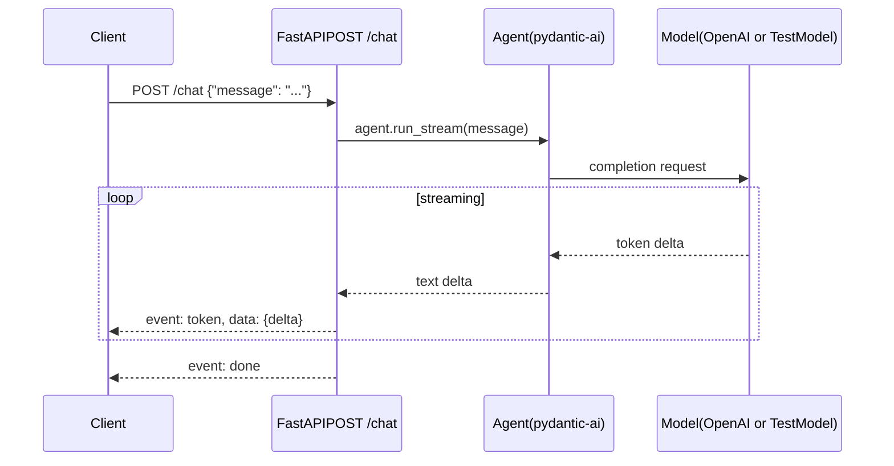

# Init scaffold: chat works, nothing persists

_Stand up the assistant repo with a working pydantic-ai Agent behind a FastAPI SSE chat endpoint, plus the directory scaffold every later phase will write into. No persistence, no tools, green CI._

## 01. Intent

> [!TIP] Goal
> Ship the `assistant/` repo with a working chat endpoint, green CI, and the directory scaffold every later phase will write into. The chat round-trips through a real pydantic-ai Agent (TestModel in CI; OpenAI locally). No persistence, no tools, no agent capabilities beyond a single-turn LLM call.
>

> [!NOTE] Non-goals
> - Persistence of any kind. No SQLite, no transcripts on disk, no session memory. Phase 1.
> - Tools, retrieval, declarative memory, skill catalog. Phases 2 through 4.
> - Authentication, rate limiting, deployment. Out of scope for a "good enough for a public repo" init.
> - Frontend beyond FastAPI's `/docs`. `curl` is the client at this phase.
> - Eval runner or judge. Phase 5. We define the fixture format and ship a loader; no execution.
>

> [!IMPORTANT] Key insight
> Phase 0 is the only phase that adds scaffolding. The shape we set here, the module boundaries, the test seams, the config surface, is the shape every later phase grows against. Get this boring and right; later phases only add.
>

## 02. Tech stack

> _Everything chosen by the progression plan. No new dependencies introduced for phase 0._

- **`pydantic-ai`**: model-call layer (Agent, retries, streaming, structured output). `§ADR-001`.
- **`fastapi` + `uvicorn[standard]`**: HTTP layer with SSE streaming.
- **`pydantic-settings`**: `.env`-driven config.
- **`structlog`**: application logs (JSON output).
- **`logfire`**: LLM tracing, conditionally enabled if `LOGFIRE_TOKEN` is set.
- **`httpx`**: ASGI transport for tests (the smoke test never spawns a real server).
- **`pyyaml`**: parse eval fixture frontmatter.
- **Dev:** `pytest`, `pytest-asyncio`, `ruff`, `mypy`.
- **Runtime:** Python 3.13 pinned. Managed by [uv](https://docs.astral.sh/uv/).

## 03. Design



_Figure. Figure 1. Single-turn chat. No state survives the request._

### Module map

Five Python modules in `assistant/`, plus tests and the vault skeleton. Each module has one responsibility and tests sit in `tests/` 1-to-1.

**repo layout**

```text
assistant/
├── pyproject.toml
├── uv.lock
├── .python-version
├── .gitignore
├── .env.example
├── LICENSE
├── README.md
├── CHANGELOG.md
├── NOTES.md
├── .github/workflows/ci.yml
├── assistant/
│   ├── __init__.py
│   ├── app.py              ← FastAPI app + /chat SSE route
│   ├── agent.py            ← pydantic-ai Agent factory
│   ├── config.py           ← pydantic-settings
│   ├── logging_setup.py    ← structlog + optional Logfire
│   └── fixtures.py         ← eval fixture loader
├── tests/
│   ├── __init__.py
│   ├── test_config.py
│   ├── test_logging_setup.py
│   ├── test_agent.py
│   ├── test_smoke.py       ← end-to-end /chat round-trip
│   └── test_fixtures.py
└── vault/
    ├── memory/.gitkeep
    ├── skills/.gitkeep
    ├── transcripts/.gitkeep
    └── evals/
        ├── .gitkeep
        └── phase-0/smoke-001.md
```

### Test seam

The Agent reaches the FastAPI route via `Depends(get_agent)`. Tests override `get_agent` with a function returning an Agent constructed against `pydantic_ai.models.test.TestModel`. Production code does not change. _Concept: test seam._ A test seam is a place where production code lets you substitute a dependency for testing; putting the Agent behind a FastAPI dependency creates exactly that.

## 04. Decisions

Plan-level decisions for phase 0 (layout, vault tracking, smoke-test fidelity, conventions) are documented in the spec, sections D1 through D4: `§docs/specs/00-init-scaffold.md`. ADRs that bake in at this phase (ADR-001 pydantic-ai, ADR-002 FastAPI, ADR-003 one growing assistant, ADR-005 dev cycle) come from the progression plan and ship with the init commit; the implementation instance does not re-derive them.

## 05. Changeset

Phase 0 is greenfield: every file is new. Counts below are for the init commit.

**Changeset**

- `+ pyproject.toml`: deps, ruff/mypy/pytest config, Python 3.13 pin
- `+ uv.lock`: locked dep graph
- `+ .python-version`: written by uv init
- `+ .gitignore`: stdlib excludes + vault content un-ignore pattern
- `+ .env.example`: template for .env
- `+ LICENSE`: MIT, 2026, Scott Clark
- `+ README.md`: vision + install + first chat
- `+ CHANGELOG.md`: init entry
- `+ NOTES.md`: phase-0 concept (framework/app boundary)
- `+ .github/workflows/ci.yml`: ruff + mypy + pytest on push and PR
- `+ assistant/__init__.py`: package marker
- `+ assistant/config.py`: Settings via pydantic-settings, cached factory
- `+ assistant/logging_setup.py`: structlog + conditional Logfire
- `+ assistant/agent.py`: build_agent factory
- `+ assistant/app.py`: FastAPI app, /chat SSE route, get_agent dependency
- `+ assistant/fixtures.py`: Fixture dataclass + load_fixture parser
- `+ tests/__init__.py`: package marker
- `+ tests/test_config.py`: defaults, env-read, cached singleton
- `+ tests/test_logging_setup.py`: token-absent and token-present branches
- `+ tests/test_agent.py`: build_agent shape, TestModel substitution
- `+ tests/test_smoke.py`: /chat round-trip via httpx ASGI transport
- `+ tests/test_fixtures.py`: load_fixture happy path + missing-frontmatter raise
- `+ vault/memory/.gitkeep`: directory only
- `+ vault/skills/.gitkeep`: directory only
- `+ vault/transcripts/.gitkeep`: directory only
- `+ vault/evals/.gitkeep`: directory only
- `+ vault/evals/phase-0/smoke-001.md`: sample fixture, loadable

## 06. Tasks

Nine tasks. Each ends with a commit. Run on branch `init/scaffold`. Squash-merge to `main` when CI is green and every box in `§Acceptance` is ticked.

> [!NOTE] Pydantic-ai API drift
> The code below targets pydantic-ai's current API (Agent constructor with `output_type`, `agent.run_stream` returning a context manager, `result.stream_text(delta=True)` for token deltas, `agent.override(model=...)` for test substitution). If `uv sync` pulls a release whose API differs, adjust the call sites; the structure (one Agent, no tools, FastAPI dependency seam) does not change.
>

### Task 1: pyproject and dependency install

**Files:** Create `pyproject.toml`, `uv.lock`, `.python-version`.

- [ ] 1.1 Run uv init --bare in the empty repo root. This writes .python-version and a starter pyproject.toml. _(scott)_
- [ ] 1.2 Replace pyproject.toml with the contents below. _(scott)_
- [ ] 1.3 Run uv sync; verify uv.lock is created and the command exits 0. _(scott)_
- [ ] 1.4 Commit: git add pyproject.toml uv.lock .python-version && git commit -m "init: scaffold repo with pyproject and Python 3.13 pin". _(scott)_

**pyproject.toml**

```toml
[project]
name = "assistant"
version = "0.0.0"
description = "Personal LLM assistant built one phase at a time."
readme = "README.md"
requires-python = ">=3.13,<3.14"
license = { text = "MIT" }
authors = [{ name = "Scott Clark" }]
dependencies = [
    "pydantic-ai>=0.0.14",
    "fastapi>=0.115",
    "uvicorn[standard]>=0.32",
    "pydantic-settings>=2.6",
    "structlog>=24.4",
    "logfire>=2.0",
    "httpx>=0.27",
    "pyyaml>=6.0",
]

[dependency-groups]
dev = [
    "pytest>=8.3",
    "pytest-asyncio>=0.24",
    "ruff>=0.7",
    "mypy>=1.13",
    "types-pyyaml>=6.0",
]

[tool.ruff]
line-length = 100
target-version = "py313"

[tool.ruff.lint]
select = ["E", "F", "I", "B", "UP", "RUF"]

[tool.mypy]
strict = true
python_version = "3.13"

[tool.pytest.ini_options]
asyncio_mode = "auto"
```

### Task 2: gitignore and vault scaffold

**Files:** Create `.gitignore`, `vault/{memory,skills,evals,transcripts}/.gitkeep`, `vault/evals/.gitkeep`.

- [ ] 2.1 Create .gitignore with the contents below. _(scott)_
- [ ] 2.2 Create the vault scaffold: mkdir -p vault/{memory,skills,transcripts,evals} && touch vault/{memory,skills,transcripts,evals}/.gitkeep. _(scott)_
- [ ] 2.3 Verify the un-ignore pattern works: touch vault/memory/probe.md && git status --porcelain | grep probe.md should print nothing (file is ignored). Remove the probe: rm vault/memory/probe.md. _(scott)_
- [ ] 2.4 Commit: git add .gitignore vault/ && git commit -m "init: gitignore + vault directory scaffold". _(scott)_

**.gitignore**

```gitignore
# Python
__pycache__/
*.py[cod]
*$py.class
.pytest_cache/
.mypy_cache/
.ruff_cache/
*.egg-info/

# uv-managed virtualenv
.venv/

# Local env
.env

# Vault: track directory shape, ignore content
vault/**
!vault/
!vault/*/
!vault/*/.gitkeep
```

### Task 3: Settings (config.py) and .env.example

**Files:** Create `assistant/__init__.py`, `assistant/config.py`, `tests/__init__.py`, `tests/test_config.py`, `.env.example`.

- [ ] 3.1 Create assistant/__init__.py (single line: """assistant package.""") and tests/__init__.py (empty). _(scott)_
- [ ] 3.2 Write the failing test at tests/test_config.py (contents below). _(scott)_
- [ ] 3.3 Run uv run pytest tests/test_config.py -v. Expect ImportError ("cannot import name 'Settings'"). _(scott)_
- [ ] 3.4 Implement assistant/config.py (contents below). _(scott)_
- [ ] 3.5 Create .env.example (contents below). _(scott)_
- [ ] 3.6 Run uv run pytest tests/test_config.py -v. Expect 3 passed. _(scott)_
- [ ] 3.7 Commit: git add assistant/__init__.py assistant/config.py tests/__init__.py tests/test_config.py .env.example && git commit -m "feat(config): Settings via pydantic-settings". _(scott)_

**tests/test_config.py**

```python
from pathlib import Path

import pytest

from assistant.config import Settings, get_settings


def test_settings_loads_defaults(monkeypatch: pytest.MonkeyPatch) -> None:
    for key in ("MODEL", "OPENAI_API_KEY", "LOGFIRE_TOKEN", "VAULT_PATH", "LOG_LEVEL"):
        monkeypatch.delenv(key, raising=False)
    settings = Settings(_env_file=None)
    assert settings.MODEL == "openai:gpt-4o-mini"
    assert settings.OPENAI_API_KEY is None
    assert settings.LOGFIRE_TOKEN is None
    assert settings.VAULT_PATH == Path("./vault")
    assert settings.LOG_LEVEL == "INFO"


def test_settings_reads_env(monkeypatch: pytest.MonkeyPatch) -> None:
    monkeypatch.setenv("MODEL", "openai:gpt-4o")
    monkeypatch.setenv("LOG_LEVEL", "DEBUG")
    settings = Settings(_env_file=None)
    assert settings.MODEL == "openai:gpt-4o"
    assert settings.LOG_LEVEL == "DEBUG"


def test_get_settings_returns_cached_instance() -> None:
    a = get_settings()
    b = get_settings()
    assert a is b
```

**assistant/config.py**

```python
from functools import lru_cache
from pathlib import Path

from pydantic_settings import BaseSettings, SettingsConfigDict


class Settings(BaseSettings):
    model_config = SettingsConfigDict(env_file=".env", extra="ignore")

    MODEL: str = "openai:gpt-4o-mini"
    OPENAI_API_KEY: str | None = None
    LOGFIRE_TOKEN: str | None = None
    VAULT_PATH: Path = Path("./vault")
    LOG_LEVEL: str = "INFO"


@lru_cache(maxsize=1)
def get_settings() -> Settings:
    return Settings()
```

**.env.example**

```bash
# Provider / model
MODEL=openai:gpt-4o-mini
OPENAI_API_KEY=

# Tracing (optional; if unset, Logfire is no-op)
LOGFIRE_TOKEN=

# Vault location (relative to repo root)
VAULT_PATH=./vault

# Logging
LOG_LEVEL=INFO
```

### Task 4: Logging setup (structlog + conditional Logfire)

**Files:** Create `assistant/logging_setup.py`, `tests/test_logging_setup.py`.

- [ ] 4.1 Write tests/test_logging_setup.py (contents below). _(scott)_
- [ ] 4.2 Run uv run pytest tests/test_logging_setup.py -v. Expect ImportError ("cannot import name 'configure_logging'"). _(scott)_
- [ ] 4.3 Implement assistant/logging_setup.py (contents below). _(scott)_
- [ ] 4.4 Run the test suite. Expect 2 passed. _(scott)_
- [ ] 4.5 Commit: git add assistant/logging_setup.py tests/test_logging_setup.py && git commit -m "feat(logging): structlog + conditional Logfire". _(scott)_

**tests/test_logging_setup.py**

```python
from unittest.mock import patch

from assistant.config import Settings
from assistant.logging_setup import configure_logging


def test_configure_logging_without_logfire_token() -> None:
    settings = Settings(_env_file=None, LOGFIRE_TOKEN=None)
    with patch("assistant.logging_setup.logfire") as mock_logfire:
        configure_logging(settings)
        mock_logfire.configure.assert_not_called()
        mock_logfire.instrument_pydantic_ai.assert_not_called()


def test_configure_logging_with_logfire_token() -> None:
    settings = Settings(_env_file=None, LOGFIRE_TOKEN="test-token")
    with patch("assistant.logging_setup.logfire") as mock_logfire:
        configure_logging(settings)
        mock_logfire.configure.assert_called_once_with(
            token="test-token", send_to_logfire=True
        )
        mock_logfire.instrument_pydantic_ai.assert_called_once()
```

**assistant/logging_setup.py**

```python
import logging

import logfire
import structlog

from assistant.config import Settings


def configure_logging(settings: Settings) -> None:
    """Set up structlog for app logs; conditionally enable Logfire for LLM tracing."""
    level_name = settings.LOG_LEVEL.upper()
    level = logging.getLevelName(level_name)
    logging.basicConfig(level=level)

    structlog.configure(
        processors=[
            structlog.processors.add_log_level,
            structlog.processors.TimeStamper(fmt="iso"),
            structlog.processors.JSONRenderer(),
        ],
        wrapper_class=structlog.make_filtering_bound_logger(level),
        cache_logger_on_first_use=True,
    )

    if settings.LOGFIRE_TOKEN:
        logfire.configure(token=settings.LOGFIRE_TOKEN, send_to_logfire=True)
        logfire.instrument_pydantic_ai()
```

### Task 5: Agent factory (agent.py)

**Files:** Create `assistant/agent.py`, `tests/test_agent.py`.

- [ ] 5.1 Write tests/test_agent.py (contents below). _(scott)_
- [ ] 5.2 Run uv run pytest tests/test_agent.py -v. Expect ImportError. _(scott)_
- [ ] 5.3 Implement assistant/agent.py (contents below). _(scott)_
- [ ] 5.4 Run the test. Expect 2 passed. _(scott)_
- [ ] 5.5 Commit: git add assistant/agent.py tests/test_agent.py && git commit -m "feat(agent): pydantic-ai Agent factory". _(scott)_

**tests/test_agent.py**

```python
import pytest
from pydantic_ai import Agent
from pydantic_ai.models.test import TestModel

from assistant.agent import build_agent
from assistant.config import Settings


def test_build_agent_returns_an_agent() -> None:
    settings = Settings(_env_file=None, MODEL="openai:gpt-4o-mini")
    agent = build_agent(settings)
    assert isinstance(agent, Agent)


@pytest.mark.asyncio
async def test_agent_run_with_test_model_returns_string() -> None:
    settings = Settings(_env_file=None, MODEL="openai:gpt-4o-mini")
    agent = build_agent(settings)
    with agent.override(model=TestModel()):
        result = await agent.run("ping")
        assert isinstance(result.output, str)
        assert result.output != ""
```

**assistant/agent.py**

```python
from pydantic_ai import Agent

from assistant.config import Settings


def build_agent(settings: Settings) -> Agent[None, str]:
    """Construct a pydantic-ai Agent with no tools, configured from settings.

    The Agent is a test seam: production code calls build_agent(get_settings());
    tests substitute via FastAPI dependency_overrides on get_agent in app.py.
    """
    return Agent(model=settings.MODEL, output_type=str)
```

### Task 6: FastAPI app, /chat SSE endpoint, smoke test

**Files:** Create `assistant/app.py`, `tests/test_smoke.py`.

- [ ] 6.1 Write tests/test_smoke.py (contents below). This is the smoke test referenced in the DOD. _(scott)_
- [ ] 6.2 Run uv run pytest tests/test_smoke.py -v. Expect ImportError. _(scott)_
- [ ] 6.3 Implement assistant/app.py (contents below). _(scott)_
- [ ] 6.4 Run the test. Expect 2 passed. _(scott)_
- [ ] 6.5 Sanity check the live app: uv run uvicorn assistant.app:app --port 8000 & then curl -N -X POST http://localhost:8000/chat -H "Content-Type: application/json" -d '{"message": "hello"}'. Without an OPENAI_API_KEY this will fail at the provider call: that is expected and documented in the README. Kill the server: kill %1. _(scott)_
- [ ] 6.6 Commit: git add assistant/app.py tests/test_smoke.py && git commit -m "feat(app): FastAPI /chat SSE endpoint + smoke test". _(scott)_

**tests/test_smoke.py**

```python
import json

import httpx
import pytest
from pydantic_ai import Agent
from pydantic_ai.models.test import TestModel

from assistant.app import build_app, get_agent
from assistant.config import Settings


@pytest.fixture
def test_app():
    settings = Settings(_env_file=None, MODEL="openai:gpt-4o-mini")
    app = build_app(settings)
    app.dependency_overrides[get_agent] = lambda: Agent(
        model=TestModel(), output_type=str
    )
    return app


@pytest.mark.asyncio
async def test_chat_returns_sse_stream(test_app) -> None:
    transport = httpx.ASGITransport(app=test_app)
    async with httpx.AsyncClient(transport=transport, base_url="http://test") as client:
        resp = await client.post("/chat", json={"message": "ping"})
        assert resp.status_code == 200
        assert resp.headers["content-type"].startswith("text/event-stream")
        assert "event: token" in resp.text
        assert "event: done" in resp.text


@pytest.mark.asyncio
async def test_chat_assembled_response_is_non_empty(test_app) -> None:
    transport = httpx.ASGITransport(app=test_app)
    async with httpx.AsyncClient(transport=transport, base_url="http://test") as client:
        resp = await client.post("/chat", json={"message": "ping"})
        tokens: list[str] = []
        for line in resp.text.splitlines():
            if line.startswith("data: ") and not line.endswith("done"):
                payload = json.loads(line[len("data: ") :])
                if "delta" in payload:
                    tokens.append(payload["delta"])
        assert "".join(tokens) != ""
```

**assistant/app.py**

```python
import json
from collections.abc import AsyncIterator

from fastapi import Depends, FastAPI
from fastapi.responses import StreamingResponse
from pydantic import BaseModel
from pydantic_ai import Agent

from assistant.agent import build_agent
from assistant.config import Settings, get_settings
from assistant.logging_setup import configure_logging


class ChatRequest(BaseModel):
    message: str


def get_agent(settings: Settings = Depends(get_settings)) -> Agent[None, str]:
    """FastAPI dependency: builds the Agent for each request.

    Tests override this in app.dependency_overrides to inject a TestModel-backed Agent.
    """
    return build_agent(settings)


def build_app(settings: Settings | None = None) -> FastAPI:
    if settings is None:
        settings = get_settings()
    configure_logging(settings)
    app = FastAPI(title="assistant", version="0.0.0")

    @app.post("/chat")
    async def chat(
        req: ChatRequest, agent: Agent[None, str] = Depends(get_agent)
    ) -> StreamingResponse:
        async def stream() -> AsyncIterator[bytes]:
            async with agent.run_stream(req.message) as result:
                async for delta in result.stream_text(delta=True):
                    payload = json.dumps({"delta": delta})
                    yield f"event: token\ndata: {payload}\n\n".encode()
            yield b"event: done\ndata: done\n\n"

        return StreamingResponse(stream(), media_type="text/event-stream")

    return app


app = build_app()
```

### Task 7: Eval fixture format and loader

**Files:** Create `assistant/fixtures.py`, `tests/test_fixtures.py`, `vault/evals/phase-0/smoke-001.md`.

- [ ] 7.1 Write tests/test_fixtures.py (contents below). _(scott)_
- [ ] 7.2 Run uv run pytest tests/test_fixtures.py -v. Expect ImportError. _(scott)_
- [ ] 7.3 Implement assistant/fixtures.py (contents below). _(scott)_
- [ ] 7.4 Create vault/evals/phase-0/smoke-001.md (contents below). Note: this file is gitignored unless added explicitly; we want it tracked because it is the canonical example. Use git add -f vault/evals/phase-0/smoke-001.md when committing. _(scott)_
- [ ] 7.5 Run the test. Expect 2 passed. _(scott)_
- [ ] 7.6 Commit: git add assistant/fixtures.py tests/test_fixtures.py && git add -f vault/evals/phase-0/smoke-001.md && git commit -m "feat(fixtures): markdown fixture format and loader". _(scott)_

**tests/test_fixtures.py**

```python
from pathlib import Path
from textwrap import dedent

import pytest

from assistant.fixtures import Fixture, load_fixture


def test_load_fixture_parses_frontmatter_and_body(tmp_path: Path) -> None:
    path = tmp_path / "f.md"
    path.write_text(
        dedent(
            """\
            ---
            id: smoke-001
            phase: 0
            intent: scaffold sanity check
            bucket: smoke
            ---

            # Input

            ping

            # Expected

            assistant reply is non-empty
            """
        )
    )
    fixture = load_fixture(path)
    assert isinstance(fixture, Fixture)
    assert fixture.id == "smoke-001"
    assert fixture.phase == 0
    assert fixture.intent == "scaffold sanity check"
    assert fixture.bucket == "smoke"
    assert "ping" in fixture.input
    assert "non-empty" in fixture.expected


def test_load_fixture_raises_on_missing_frontmatter(tmp_path: Path) -> None:
    path = tmp_path / "bad.md"
    path.write_text("just some content with no frontmatter\n")
    with pytest.raises(ValueError, match="frontmatter"):
        load_fixture(path)
```

**assistant/fixtures.py**

```python
import re
from dataclasses import dataclass
from pathlib import Path
from typing import Any

import yaml


@dataclass(frozen=True)
class Fixture:
    id: str
    phase: int
    intent: str
    bucket: str
    input: str
    expected: str
    raw_frontmatter: dict[str, Any]


_FRONTMATTER_RE = re.compile(r"^---\n(.+?)\n---\n(.+)$", re.DOTALL)


def load_fixture(path: Path) -> Fixture:
    """Parse a markdown fixture with YAML frontmatter and # Input / # Expected sections."""
    text = path.read_text()
    match = _FRONTMATTER_RE.match(text)
    if not match:
        raise ValueError(f"Missing YAML frontmatter in fixture: {path}")
    fm_yaml, body = match.groups()
    fm = yaml.safe_load(fm_yaml)
    input_part, expected_part = _split_body(body)
    return Fixture(
        id=fm["id"],
        phase=fm["phase"],
        intent=fm["intent"],
        bucket=fm["bucket"],
        input=input_part,
        expected=expected_part,
        raw_frontmatter=fm,
    )


def _split_body(body: str) -> tuple[str, str]:
    parts = re.split(r"^#\s+(?:Input|Expected)\s*$", body, flags=re.MULTILINE)
    if len(parts) < 3:
        raise ValueError("Fixture body must have '# Input' and '# Expected' sections")
    return parts[1].strip(), parts[2].strip()
```

**vault/evals/phase-0/smoke-001.md**

```markdown
---
id: smoke-001
phase: 0
intent: scaffold sanity check
bucket: smoke
---

# Input

ping

# Expected

assistant reply is non-empty
```

### Task 8: GitHub Actions CI

**Files:** Create `.github/workflows/ci.yml`.

- [ ] 8.1 Create .github/workflows/ci.yml (contents below). _(scott)_
- [ ] 8.2 Simulate CI locally to verify the workflow's commands all succeed: uv sync && uv run ruff check && uv run ruff format --check && uv run mypy assistant && uv run pytest. All five must exit 0. _(scott)_
- [ ] 8.3 Commit: git add .github/workflows/ci.yml && git commit -m "ci: ruff + mypy + pytest on push and PR". _(scott)_

**.github/workflows/ci.yml**

```yaml
name: CI

on:
  push:
  pull_request:

jobs:
  ci:
    runs-on: ubuntu-latest
    steps:
      - uses: actions/checkout@v4

      - name: Install uv
        uses: astral-sh/setup-uv@v3
        with:
          python-version: "3.13"

      - name: Install dependencies
        run: uv sync

      - name: Ruff check
        run: uv run ruff check

      - name: Ruff format check
        run: uv run ruff format --check

      - name: Mypy
        run: uv run mypy assistant

      - name: Pytest
        run: uv run pytest
```

### Task 9: Documentation (README, LICENSE, CHANGELOG, NOTES)

**Files:** Create `README.md`, `LICENSE`, `CHANGELOG.md`, `NOTES.md`.

- [ ] 9.1 Create README.md (contents below). _(scott)_
- [ ] 9.2 Create LICENSE (MIT, year 2026, author "Scott Clark"; contents below). _(scott)_
- [ ] 9.3 Create CHANGELOG.md (contents below; replace YYYY-MM-DD with the merge date once known). _(scott)_
- [ ] 9.4 Create NOTES.md (contents below). _(scott)_
- [ ] 9.5 Commit: git add README.md LICENSE CHANGELOG.md NOTES.md && git commit -m "docs: README, LICENSE, CHANGELOG, NOTES for init". _(scott)_

**README.md**

```markdown
# assistant

A personal LLM assistant, built one phase at a time. pydantic-ai handles the model layer; everything above it is hand-rolled.

## Install

Requires Python 3.13 and [uv](https://docs.astral.sh/uv/).

```bash
git clone https://github.com/<your-handle>/assistant.git
cd assistant
uv sync
cp .env.example .env
# edit .env: set OPENAI_API_KEY at minimum
```

## First chat

```bash
uv run uvicorn assistant.app:app
```

Then in another terminal:

```bash
curl -N -X POST http://localhost:8000/chat \
  -H "Content-Type: application/json" \
  -d '{"message": "hello"}'
```

You will see a stream of SSE events: `event: token` with delta tokens, then `event: done` when the response completes.

The OpenAPI spec is at <http://localhost:8000/docs>.

## What this is

A single growing repo. Each phase merges to `main` as a feature branch with tests, evals, a CHANGELOG entry, and a NOTES.md section. See `NOTES.md` for the one concept each phase teaches.

## License

MIT. See `LICENSE`.
```

**LICENSE**

```text
MIT License

Copyright (c) 2026 Scott Clark

Permission is hereby granted, free of charge, to any person obtaining a copy
of this software and associated documentation files (the "Software"), to deal
in the Software without restriction, including without limitation the rights
to use, copy, modify, merge, publish, distribute, sublicense, and/or sell
copies of the Software, and to permit persons to whom the Software is
furnished to do so, subject to the following conditions:

The above copyright notice and this permission notice shall be included in all
copies or substantial portions of the Software.

THE SOFTWARE IS PROVIDED "AS IS", WITHOUT WARRANTY OF ANY KIND, EXPRESS OR
IMPLIED, INCLUDING BUT NOT LIMITED TO THE WARRANTIES OF MERCHANTABILITY,
FITNESS FOR A PARTICULAR PURPOSE AND NONINFRINGEMENT. IN NO EVENT SHALL THE
AUTHORS OR COPYRIGHT HOLDERS BE LIABLE FOR ANY CLAIM, DAMAGES OR OTHER
LIABILITY, WHETHER IN AN ACTION OF CONTRACT, TORT OR OTHERWISE, ARISING FROM,
OUT OF OR IN CONNECTION WITH THE SOFTWARE OR THE USE OR OTHER DEALINGS IN THE
SOFTWARE.
```

**CHANGELOG.md**

```markdown
# Changelog

All notable changes to this project will be documented in this file.

## [0.0.0] - YYYY-MM-DD

### Init

- pydantic-ai Agent (zero tools) wired through a FastAPI `/chat` SSE endpoint.
- pydantic-settings for `.env`-driven config; default `MODEL=openai:gpt-4o-mini`.
- Conditional Logfire instrumentation; structlog for application logs.
- Vault scaffold (`vault/{memory,skills,evals,transcripts}/`) with content gitignored.
- Eval fixture format defined; one sample fixture loadable.
- Ruff + mypy + pytest; GitHub Actions CI on push and PR.
```

**NOTES.md**

```markdown
# Notes

One section per phase. Captures the one concept the phase teaches, with pointers into the code.

## Init scaffold (phase 0)

### Concept: the boundary between framework and application

pydantic-ai owns the model-call layer: the Agent runs the prompt-to-response loop, retries on validation failure, formats tool calls, and decodes streaming output. Application code never imports a provider SDK directly. The seam is `pydantic_ai.Agent` in `assistant/agent.py`: tests substitute `pydantic_ai.models.test.TestModel` via FastAPI's `dependency_overrides`, and production code stays unchanged.

This is the pattern every later phase preserves: framework handles model plumbing, app code handles memory, skills, evals, planning.

### Pointers

- `assistant/agent.py` — the model boundary in one factory function.
- `assistant/app.py` — `get_agent` is the FastAPI dependency seam.
- `tests/test_smoke.py` — TestModel substitution in action.
```

## 07. Risks

| Risk | Severity | Likelihood | Mitigation |
|---|---|---|---|
| pydantic-ai API drifts between the snapshot this plan targets and the version uv sync resolves. Method names or signatures change; tests break on import. | Medium | Likely | The Caveat callout in Tasks calls this out. If sync pulls an incompatible release, pin pydantic-ai to a known-working version in pyproject.toml. Upgrade is a deliberate later-phase task. |
| Logfire token format or network path changes; the conditional configure call fails at startup with the token set. | Low | Possible | Token presence is checked at runtime, not import-time. A future task could wrap the logfire.configure call in try/except so app startup never fails on tracing setup; for phase 0 the simpler path (configure runs, surfaces errors) is acceptable. |
| SSE response shape disagrees with whatever client phase 1 ships (CLI or otherwise). Events named token and done may need to become something else. | Low | Possible | There is no downstream client at init. Phase 1 ships a CLI client and an integration test that exercises the SSE shape end-to-end. If the shape needs to change, it changes in phase 1 with the test as ground truth. |
| Vault .gitignore pattern is brittle: a future contributor adds a file at vault/notes.md (one level deep), it gets accidentally tracked because the un-ignore pattern matches vault/*/ only. | Low | Possible | Top-level files in vault/ are not expected. If they appear, they are config or scaffolding and probably belong tracked. The verification step in Task 2.3 catches the common case (file under a subdir is ignored). Document the pattern in NOTES.md if a future phase needs to evolve it. |

## 08. Acceptance

Lifted from progression plan §13.1 with phase-0-specific verification commands.

- [ ] Public GitHub repo assistant/ exists, MIT-licensed. _(scott)_
- [ ] README.md contains vision + install + first-chat instructions. _(scott)_
- [ ] pyproject.toml has Python 3.13 pin; uv.lock committed. _(scott)_
- [ ] uv run ruff check exits 0. _(scott)_
- [ ] uv run ruff format --check exits 0. _(scott)_
- [ ] uv run mypy assistant exits 0. _(scott)_
- [ ] uv run pytest exits 0 with all tests passing. _(scott)_
- [ ] CI smoke test is green on push to init/scaffold. _(scott)_
- [ ] .env.example committed; .env gitignored. _(scott)_
- [ ] FastAPI OpenAPI spec is reachable at /docs when the server is running. _(scott)_
- [ ] No provider-SDK imports in app code: grep -r "import openai\|from openai" assistant/ prints nothing. _(scott)_
- [ ] Logfire wiring is conditional: app starts cleanly with LOGFIRE_TOKEN unset. _(scott)_
- [ ] CHANGELOG.md and NOTES.md have one entry each for the init commit. _(scott)_
- [ ] vault/{memory,skills,evals,transcripts}/.gitkeep committed; vault content gitignored (verified in Task 2.3). _(scott)_
- [ ] One eval fixture loadable via load_fixture() (verified by tests/test_fixtures.py). _(scott)_
- [ ] Squash-merge init/scaffold into main; main contains the init commit. _(scott)_
