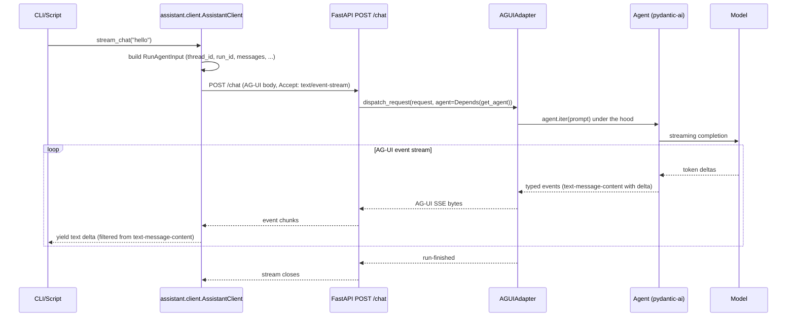

# AG-UI migration: one canonical wire, one Python adapter

_Replace the hand-rolled /chat SSE endpoint with pydantic-ai's AGUIAdapter so every external consumer speaks AG-UI. Ship a thin async Python client adapter (`assistant/client.py`) so CLI/TUI/script consumers don't pay AG-UI's request/event boilerplate._

> [!NOTE] Read first
> `docs/references/ag-ui-surface.md` (planner seed; Task 1 verifies and refines against the live import). Every subsequent task cites the pinned field names and event-name strings recorded there.
>

## 01. Intent

> [!TIP] Goal
> Make `/chat` speak AG-UI as its sole wire format. Any HTTP consumer (browser via CopilotKit, Python script, CLI, future TUI) uses the same endpoint. Hide AG-UI's verbosity behind a small async Python adapter (`assistant/client.py`) so in-Python consumers stay one-liners. Preserve the test seam (`Depends(get_agent)` + `dependency_overrides`).
>

> [!NOTE] Non-goals
> - Tools. AG-UI has a tool event vocabulary; we have zero tools at scaffold time. The migration is wire-format only.
> - State management (`StateDeps`). Phase 3 territory (memory). Wire it later when there's state to manage.
> - A browser UI. We lay the foundation that CopilotKit / AG-UI React components could plug into; we're not building one yet.
> - Replacing the smoke-test architecture. Same `dependency_overrides[get_agent]` + TestModel pattern. Only the asserted wire format changes.
> - Persistence, transcripts, replay. Still phase 1 per the progression plan; this migration does not displace it. Phase 1 begins after this plan merges.

> [!IMPORTANT] Key insight
> The seam moves up one layer. The init plan put the seam at "the FastAPI route handles SSE formatting; tests override the Agent." This plan moves it to "the FastAPI route delegates wire-format concerns to pydantic-ai; we own a Python adapter that translates AG-UI events into whatever shape the caller wants." The Agent itself, the dependency injection, and the test substitution pattern all stay identical. We swap the fiddliest hand-roll (SSE formatting) for a vendored implementation, and trade the simplicity of `{"message": "..."}` for the structure of an AG-UI `RunAgentInput`. The adapter is what restores the one-liner UX for callers that don't need the structure.
>

## 02. Tech stack

> _No new top-level dependencies. AG-UI support ships inside the pydantic-ai package we already have (`pydantic_ai.ui.ag_ui.AGUIAdapter`). The `ag_ui.core` event types are pulled transitively by pydantic-ai's `ag-ui` extra. Preflight verifies importability and adds the extra if needed._

- **`pydantic-ai`** (already installed): `pydantic_ai.ui.ag_ui.AGUIAdapter` server-side; `ag_ui.core` for client-side event types.
- **`fastapi` / `uvicorn` / `httpx`** unchanged.
- **`pyproject.toml`** may need `pydantic-ai[ag-ui]` instead of `pydantic-ai`; preflight decides.

Cross-phase context (wire shape, event vocabulary, version pin): `docs/references/ag-ui-surface.md`.

## 03. Design



_Figure 1. AG-UI is the canonical wire. The CLI/script consumer asks the Python adapter for text deltas; the adapter constructs the AG-UI request, parses the event stream, and surfaces just what the caller asked for._

### Module map

What changes, what's new, what stays put.

**unchanged**

- `assistant/agent.py` — the Agent factory. Same `build_agent(settings)`, same `defer_model_check=True`. Wire-format migration does not touch the Agent layer.
- `assistant/config.py`, `assistant/logging_setup.py`, `assistant/fixtures.py` — none affected.
- `tests/test_agent.py`, `tests/test_config.py`, `tests/test_logging_setup.py`, `tests/test_fixtures.py` — none affected.

**modified**

- `assistant/app.py` — `/chat` route delegates to `AGUIAdapter.dispatch_request(request, agent=Depends(get_agent))`. Hand-rolled stream generator + `ChatRequest` BaseModel deleted. `Depends(get_agent)` seam survives.
- `tests/test_smoke.py` — assertions move from `event: token` / `event: done` to AG-UI event names (per `docs/references/ag-ui-surface.md`). Same fixture (`httpx.ASGITransport` + `dependency_overrides[get_agent]` + TestModel).
- `dev/insomnia-assistant.json` — POST body becomes a valid AG-UI `RunAgentInput`.
- `README.md` — first-chat section leads with the Python adapter; raw curl second.
- `CHANGELOG.md` — AG-UI migration entry.
- `NOTES.md` — new section: "wire-protocol adapter as a seam."
- `docs/references/agent-http-patterns.html` — add "Approach 0: AG-UI native (what we use)" at the top; relabel the previous Approach 2 as the launch-time baseline.

**new**

- `assistant/client.py` — `AssistantClient` with `stream_chat(message: str) -> AsyncIterator[str]`. Hides AG-UI request construction and event parsing.
- `tests/test_client.py` — exercises `AssistantClient` against the in-memory FastAPI app via `httpx.ASGITransport`.
- `docs/references/ag-ui-surface.md` — already seeded; this phase refines it.

### Test seams

Two seams; both preserved from phase 0.

1. **Server-side: `Depends(get_agent)`.** Tests override `get_agent` in `app.dependency_overrides` to inject a TestModel-backed Agent. `AGUIAdapter.dispatch_request` accepts the `agent` parameter, so the dep-injected Agent flows through. Without this seam the smoke test would have to hit OpenAI.
2. **Client-side: injectable `httpx.AsyncClient`.** `AssistantClient.__init__` accepts an optional `httpx_client`. Tests pass a client configured with `httpx.ASGITransport(app=test_app)` so the adapter talks to an in-memory FastAPI instance without a real network.

## 04. Decisions

**D1. AG-UI as the only wire format.** Decided at the spec level in `docs/specs/00-init-scaffold.md` §D5 (rejected alternatives listed there: dual-endpoint setup, body-shape detection, defer indefinitely). This plan implements that decision.

**D2. Python adapter lives in `assistant/client.py`.** Keeps the migration self-contained. If the adapter later grows enough to want its own repo (or to be published as a wheel), splitting is straightforward: no production-code imports of `assistant.client` (it's a consumer library, not part of the server).

**D3. Adapter API is async-first; sync wrapper deferred.** `stream_chat` is an `AsyncIterator[str]`. Sync callers wrap with `asyncio.run` themselves. A `stream_chat_sync` is a one-line wrapper; ship it when the second sync caller appears.

**D4. `AGUIAdapter.dispatch_request` over the manual `build_run_input` / `run_stream` / `encode_stream` flow.** The convenience method handles validation, parsing, and encoding. We forfeit some control (custom request validation, custom error responses). Acceptable now; drop to the manual flow if a request-size limit, per-thread quota, or per-request auth check needs to fire before the agent runs.

**D5. Rollback target is `main`'s pre-migration commit.** No tag needed: the init plan merges to `main` first; this branch comes off that commit; if AG-UI proves wrong-shape, `git revert` the AG-UI squash on `main`. The `hand-rolled-sse` tag from `init/scaffold` is a historical marker, not a rollback baseline.

## 05. Changeset

This migration is focused. Counts are post-merge.

- `~ assistant/app.py`: `/chat` delegates to `AGUIAdapter.dispatch_request`. Drop hand-rolled SSE generator, `ChatRequest` BaseModel, and the `json` / `StreamingResponse` / `AsyncIterator` imports they required. Keep `get_agent` and the dependency seam.
- `~ tests/test_smoke.py`: rewrite assertions for AG-UI event vocabulary. Same fixture, same shape (POST + assert content type + assert event presence + assert text reassembly + assert TestModel actually fired).
- `+ assistant/client.py`: `AssistantClient` with `stream_chat(message) -> AsyncIterator[str]`.
- `+ tests/test_client.py`: exercises `AssistantClient` against the in-memory app.
- `~ docs/references/ag-ui-surface.md`: implementer-side refinement (verified field names, event-name strings, redacted sample SSE, `last-verified` date).
- `~ dev/insomnia-assistant.json`: POST body becomes a valid AG-UI `RunAgentInput`. `description` field points to the reference doc.
- `~ README.md`: first-chat section leads with the Python adapter; curl shown second.
- `~ CHANGELOG.md`: AG-UI migration entry.
- `~ NOTES.md`: new "## AG-UI migration" section, concept: wire-protocol adapter as a seam.
- `~ docs/references/agent-http-patterns.html`: add Approach 0 (AG-UI native), relabel previous Approach 2 as launch-time baseline, update comparison matrix.
- `? pyproject.toml`: only if preflight finds `ag_ui.core` not importable; change `"pydantic-ai>=…"` → `"pydantic-ai[ag-ui]>=…"` and `uv sync`.

## 06. Tasks

Seven tasks plus preflight. Each task ends with a commit. Run on branch `refactor/ag-ui-migration` off `main`. Squash-merge to `main` when remote CI is green and every box in §08 Acceptance is ticked.

### Preflight (do before branching)

Single goal: don't start a branch you'll have to abandon. Verify the precondition state.

- [ ] **PF1.** The init plan (`init/scaffold`) is merged to `main` on the remote. `git log main --oneline -1` shows the init squash; `git rev-parse main@{upstream}` resolves. _(scott)_
- [ ] **PF2.** `ag_ui.core` is importable: `uv run python -c "from ag_ui.core import RunAgentInput, EventType; print(list(RunAgentInput.model_fields.keys())); print([e.value for e in EventType])"` prints non-empty lists. _(scott)_
- [ ] **PF3.** If PF2 raises `ImportError`, change `pydantic-ai>=…` to `pydantic-ai[ag-ui]>=…` in `pyproject.toml`, `uv sync`, and retry PF2. Commit on `main` (or fold into Task 1's first commit) as `chore(deps): pull pydantic-ai[ag-ui] for AGUIAdapter`. _(scott)_
- [ ] **PF4.** Create the branch: `git checkout main && git pull && git checkout -b refactor/ag-ui-migration`. _(scott)_

### Task 1: Verify and refine the AG-UI surface reference doc

**Files:** `docs/references/ag-ui-surface.md`.

**Contract:** by end of task, the reference doc's frontmatter `last-verified` is set to today's date, the `pydantic-ai-pin` matches the actually-installed version, all field names in the `RunAgentInput` table match `RunAgentInput.model_fields.keys()` exactly (including case), all event-name wire strings match `EventType` enum values exactly, and the redacted sample SSE bytes section is filled in from a probe POST against an inline `AGUIAdapter` app. Every later task in this plan cites the reference doc as its source of truth for wire shape.

- [ ] **1.1** Capture the exact `RunAgentInput` field names and casing from `RunAgentInput.model_fields.keys()`; update the table in the reference doc; note any difference between the seed and the verified set. _(scott)_
- [ ] **1.2** Capture the exact event-type strings from the `EventType` enum; update the table; note any dashed vs camelCase difference from the seed. _(scott)_
- [ ] **1.3** Probe live shape: run a small one-off Python script that constructs an inline FastAPI app (or `TestClient`) wired to `AGUIAdapter.dispatch_request` with a TestModel-backed Agent; POST a minimal `RunAgentInput`; capture the raw SSE response bytes; redact and paste a representative slice into the reference doc. _(scott)_
- [ ] **1.4** Set `last-verified` to the current date and `pydantic-ai-pin` to the installed minor-version range in the reference doc frontmatter. _(scott)_
- [ ] **1.5** Commit: `docs(refs): verify AG-UI surface against live pydantic-ai`. _(scott)_

### Task 2: Replace `/chat` with `AGUIAdapter`

**Files:** `assistant/app.py`.

**Contract:** `assistant/app.py`'s `/chat` route delegates wire-format handling to `AGUIAdapter.dispatch_request(request, agent=agent)`. The `Depends(get_agent)` seam is preserved (`grep -n "Depends(get_agent)" assistant/app.py` returns a hit). The hand-rolled stream generator, the `ChatRequest` BaseModel, and the now-unused imports (`json`, `StreamingResponse`, `AsyncIterator`) are removed. `build_app`, `configure_logging` call, and `get_agent` factory are unchanged. `uv run ruff check` and `uv run mypy assistant` pass.

Smoke test is expected to fail at the end of this task (it still asserts the old shape). Task 3 fixes that in the next commit. The commit message acknowledges this.

- [ ] **2.1** Edit `assistant/app.py` to satisfy the contract. _(scott)_
- [ ] **2.2** Run `uv run ruff check`, `uv run ruff format --check`, `uv run mypy assistant` — all exit 0. _(scott)_
- [ ] **2.3** Run `uv run pytest tests/test_smoke.py -v` — expect failure (asserting `event: token` against AG-UI events). _(scott)_
- [ ] **2.4** Commit: `feat(app): delegate /chat to AGUIAdapter (smoke test red until Task 3)`. _(scott)_

### Task 3: Rewrite the smoke test for AG-UI event shape

**Files:** `tests/test_smoke.py`.

**Contract:** two tests in `tests/test_smoke.py`, both using a fixture that builds the app and overrides `get_agent` to return a TestModel-backed Agent.

- `test_chat_returns_ag_ui_stream`: POST a minimal `RunAgentInput` (constructed from the reference doc's verified field names); assert 200; assert `content-type` starts with `text/event-stream`; assert the response text contains the verified text-content event name AND the verified run-finished event name.
- `test_chat_assembled_text_is_non_empty`: parse the SSE stream, filter to text-content events, concatenate `delta` fields, assert non-empty.

In addition, at least one of the two tests must contain an assertion that fails if `dependency_overrides[get_agent]` did NOT take effect: e.g., assert the assembled text contains a marker that only `TestModel` emits (such as the literal `success` prefix TestModel uses for free-form output, or whatever distinctive marker the installed `TestModel` produces). If `dispatch_request` quietly grabbed a different Agent, this assertion fails meaningfully rather than the test passing because OpenAI happens to be reachable from the dev environment.

- [ ] **3.1** Rewrite `tests/test_smoke.py` to satisfy the contract. The fixture pattern (`httpx.ASGITransport` + `app.dependency_overrides[get_agent]`) is unchanged from phase 0; only assertions and request body change. _(scott)_
- [ ] **3.2** Run `uv run pytest tests/test_smoke.py -v` — both tests pass. _(scott)_
- [ ] **3.3** Run full suite: `uv run pytest -v` — all phase-0 tests still pass, plus the two new smoke tests. _(scott)_
- [ ] **3.4** Run ruff + mypy — clean. _(scott)_
- [ ] **3.5** Commit: `test(smoke): assert AG-UI event shape and override-fired marker`. _(scott)_

### Task 4: Python client adapter

**Files:** `assistant/client.py` (new), `tests/test_client.py` (new).

**Contract:** `assistant/client.py` exposes `AssistantClient` with the public surface:

```python
class AssistantClient:
    def __init__(
        self,
        base_url: str = "http://localhost:8000",
        httpx_client: httpx.AsyncClient | None = None,
    ) -> None: ...

    async def stream_chat(self, message: str) -> AsyncIterator[str]: ...
```

`stream_chat` constructs a minimal `RunAgentInput` (single user message; UUID-shaped `thread_id`, `run_id`, message `id`; tools/state/context default-empty per the reference doc), POSTs to `<base_url>/chat` with `Accept: text/event-stream`, parses the SSE stream, filters to text-content events, yields each event's `delta` field. Non-text events (run-started, run-finished, text-message-start/end) do not appear in the yielded stream.

`tests/test_client.py` covers two behaviors against the in-memory app via `httpx.ASGITransport`:

- `test_stream_chat_yields_text_deltas`: construct `AssistantClient(httpx_client=...)` pointed at the test app; iterate `stream_chat("ping")`; assert the assembled deltas are non-empty.
- `test_stream_chat_filters_non_text_events`: assert the yielded items are pure text deltas — no run-started, run-finished, or text-message-start/end strings appear in any yielded item.

Type-checks under `mypy --strict`. Where the SSE parser deserializes JSON event payloads, `dict[str, Any]` is acceptable for the parsed payload provided each event-type branch narrows to its specific shape before yielding.

- [ ] **4.1** Write `tests/test_client.py` first (TDD). _(scott)_
- [ ] **4.2** Run the tests — expect `ImportError` on `assistant.client`. _(scott)_
- [ ] **4.3** Implement `assistant/client.py` to satisfy the contract. SSE parsing is a small internal helper; no public surface beyond `AssistantClient`. _(scott)_
- [ ] **4.4** Run `uv run pytest tests/test_client.py -v` — both tests pass. _(scott)_
- [ ] **4.5** Run full suite — all tests pass (smoke + client + phase-0 carryovers). _(scott)_
- [ ] **4.6** Run ruff + mypy — clean. _(scott)_
- [ ] **4.7** Commit: `feat(client): async Python adapter for AG-UI /chat`. _(scott)_

### Task 5: Update `dev/insomnia-assistant.json`

**Files:** `dev/insomnia-assistant.json`.

**Contract:** the collection's `POST /chat` request body is a valid AG-UI `RunAgentInput` (UUID-shaped strings the user can edit; use the smoke test fixture as the template). The request's `description` field references `docs/references/ag-ui-surface.md`. Once imported into Insomnia and Sent against a running uvicorn, the request returns an AG-UI event stream (manual verification once during this task; do not commit the verification output).

- [ ] **5.1** Edit the JSON file to satisfy the contract. _(scott)_
- [ ] **5.2** Import the collection into Insomnia; restart uvicorn (or rely on `--reload`); Send; confirm an AG-UI event stream comes back. _(scott)_
- [ ] **5.3** Commit: `chore(dev): update Insomnia collection for AG-UI request shape`. _(scott)_

### Task 6: Documentation

**Files:** `README.md`, `CHANGELOG.md`, `NOTES.md`, `docs/references/agent-http-patterns.html`.

**Contract:** four artifacts updated to reflect AG-UI as canonical.

- `README.md` first-chat section leads with the Python adapter one-liner (`from assistant.client import AssistantClient; async for d in AssistantClient().stream_chat("hello"): print(d, end="")`, with the `uv run python -c "..."` wrapper). The raw `curl` example follows, framed as "what the adapter does for you under the hood." Links to `docs/references/ag-ui-surface.md` and the AG-UI spec.
- `CHANGELOG.md` gets a `## [0.0.1] - <merge-date>` entry (scaffold-level bump; phase 1 will earn `0.1.0`): AG-UI as canonical wire format; `assistant.client` adapter; smoke test updated; Insomnia regenerated; `hand-rolled-sse` tag preserved as the launch-time historical marker.
- `NOTES.md` gets `## AG-UI migration`. Concept: **wire-protocol adapter as a seam.** Body: the server speaks one canonical protocol; consumers that don't want the verbosity get a client-side adapter that translates. Pointers: `assistant/app.py` (server delegation), `assistant/client.py` (client adapter), `tests/test_smoke.py` and `tests/test_client.py` (both seams exercised).
- `docs/references/agent-http-patterns.html` gets a new "Approach 0: AG-UI native (what we use)" section at the top. The previous "Approach 2: SSE deltas" is relabeled as the launch-time baseline (tagged `hand-rolled-sse` on the init/scaffold branch). The intro paragraph acknowledges the framework's built-in option as the first answer. Comparison matrix updated with the new row.

- [ ] **6.1** Edit `README.md`. _(scott)_
- [ ] **6.2** Edit `CHANGELOG.md`. _(scott)_
- [ ] **6.3** Edit `NOTES.md`. _(scott)_
- [ ] **6.4** Edit `docs/references/agent-http-patterns.html`. _(scott)_
- [ ] **6.5** Commit: `docs: README, CHANGELOG, NOTES, HTTP patterns for AG-UI migration`. _(scott)_

### Task 7: Local CI + I5 verification + remote push + merge

**Files:** none (verification + merge).

**Contract:**

- Local CI sim exits 0 on every step: `uv sync && uv run ruff check && uv run ruff format --check && uv run mypy assistant && uv run pytest`.
- §I5 invariant (Logfire instrumentation) survives the migration. Manual probe: with `LOGFIRE_TOKEN` set, start uvicorn, POST a `RunAgentInput` via the Python adapter or curl, confirm at least one trace span appears in Logfire for the `/chat` request. The instrumentation hooks `Agent`, not the FastAPI surface, so this is expected to be a no-op verification; if it fails the migration has regressed I5 and Task 7 blocks merge until fixed.
- Push `feat/ag-ui-migration`. Remote CI passes on first push. If CI fails, fix and re-push; do not merge red.
- Squash-merge to `main` via PR.

- [ ] **7.1** Run the local CI sim; all five commands exit 0. _(scott)_
- [ ] **7.2** Walk §08 Acceptance; tick every box that the branch has earned. _(scott)_
- [ ] **7.3** Manual I5 probe: with `LOGFIRE_TOKEN` set, POST a `RunAgentInput`; confirm the request trace appears in Logfire. _(scott)_
- [ ] **7.4** Push the branch: `git push -u origin feat/ag-ui-migration`. _(scott)_
- [ ] **7.5** Wait for remote CI green. If red, fix and re-push. _(scott)_
- [ ] **7.6** Squash-merge to `main` via PR. _(scott)_

## 07. Risks

| Risk | Severity | Likelihood | Mitigation |
|---|---|---|---|
| AG-UI event-name strings or `RunAgentInput` field casing differ from spec docs (e.g., dashed vs camelCase). Smoke test assertions are wrong against the real wire. | Medium | Possible | Task 1 probes the live shape and writes the verified strings into the reference doc; Tasks 2–4 cite the reference, not assumptions. |
| pydantic-ai's `AGUIAdapter` expected `RunAgentInput` schema changes between minor versions. Smoke fixture and client adapter both break. | Medium | Possible at minor-version bumps | Pin pydantic-ai floor at the version verified in Task 1; document the version in the reference doc; re-verify at every minor bump. |
| `dependency_overrides[get_agent]` doesn't actually take effect through `AGUIAdapter.dispatch_request` (the adapter constructs or grabs an Agent from a different scope). Smoke test passes for the wrong reason. | High | Unlikely (the API takes `agent` as a parameter) | Task 3 requires an assertion that fails if the override didn't fire (TestModel-distinctive output marker). If that assertion fails, drop to the manual `build_run_input` / `run_stream` / `encode_stream` flow where the dep-injected agent is explicitly threaded. |
| `ag_ui.core` is not installed (pydantic-ai's `[ag-ui]` extra wasn't pulled by the current dep spec). Tasks 2 and 4 import-fail. | Medium | Possible | Preflight PF2/PF3 add the extra before branching. The branch doesn't start until imports work. |
| The client adapter's SSE parser mishandles a wire-format edge case (multi-line `data:`, missing `event:`, CR/LF). Tests pass on the happy path but the adapter is brittle in production. | Low | Possible | Tasks 4.1–4.4 cover the happy path. If Task 1's redacted SSE sample reveals multi-line data, add a third client test for that case; otherwise YAGNI. Parser is small; standalone-tested. |
| AG-UI's per-request boilerplate makes `curl` examples in the README intimidating, deterring new contributors. | Low | Likely | Task 6 leads with the Python adapter; curl is shown second, framed as "what the adapter does for you." |
| Browser-side AG-UI client (CopilotKit etc.) is not exercised; we assume compatibility based on spec adherence. A later web UI could surface incompatibilities. | Low | Possible | Out of scope for this migration. AG-UI spec compliance is pydantic-ai's responsibility; our wire is whatever its adapter emits. Defer to actual browser integration. |
| I5 (Logfire instrumentation) silently regresses through `AGUIAdapter.dispatch_request`. | Medium | Unlikely | Task 7.3 manually verifies a trace appears. The hook is at the Agent layer, which the adapter still drives. |

## 08. Acceptance

- [ ] `feat/ag-ui-migration` branched off `main`'s phase-0 squash commit (PF4). _(scott)_
- [ ] `docs/references/ag-ui-surface.md` has `last-verified` set, `pydantic-ai-pin` set, all field names and event-name strings verified against the live import (Task 1). _(scott)_
- [ ] `pyproject.toml` pins pydantic-ai at the verified version range (Task 1.4 / PF3). _(scott)_
- [ ] `assistant/app.py`'s `/chat` delegates to `AGUIAdapter.dispatch_request`. `grep -n "AGUIAdapter.dispatch_request" assistant/app.py` returns a hit; `grep -nE "event: token|event: done" assistant/` returns nothing. _(scott)_
- [ ] `Depends(get_agent)` preserved. `grep -n "Depends(get_agent)" assistant/app.py` returns a hit. _(scott)_
- [ ] `tests/test_smoke.py::test_chat_returns_ag_ui_stream` passes. _(scott)_
- [ ] `tests/test_smoke.py::test_chat_assembled_text_is_non_empty` passes. _(scott)_
- [ ] At least one smoke test contains an assertion that fails if `dependency_overrides[get_agent]` did not take effect (TestModel-distinctive marker in the assembled output). _(scott)_
- [ ] `assistant/client.py` exposes `AssistantClient.stream_chat(message: str) -> AsyncIterator[str]`. _(scott)_
- [ ] `tests/test_client.py::test_stream_chat_yields_text_deltas` passes. _(scott)_
- [ ] `tests/test_client.py::test_stream_chat_filters_non_text_events` passes. _(scott)_
- [ ] `uv run ruff check` exits 0. _(scott)_
- [ ] `uv run ruff format --check` exits 0. _(scott)_
- [ ] `uv run mypy assistant` exits 0 (strict mode, includes `client.py`). _(scott)_
- [ ] `uv run pytest` exits 0; every named test in this acceptance list appears in the report and passes. _(scott)_
- [ ] `dev/insomnia-assistant.json` POSTs a valid AG-UI `RunAgentInput`; manual Send returns an event stream. _(scott)_
- [ ] `README.md` first-chat section leads with the Python adapter; curl shown second. _(scott)_
- [ ] `CHANGELOG.md` has a `[0.0.1]` entry referencing AG-UI migration. _(scott)_
- [ ] `NOTES.md` has `## AG-UI migration` with the wire-protocol-adapter-as-a-seam concept. _(scott)_
- [ ] `docs/references/agent-http-patterns.html` has "Approach 0: AG-UI native (what we use)" at the top and an updated comparison matrix. _(scott)_
- [ ] §I5 invariant verified manually: a `/chat` request emits a Logfire trace when `LOGFIRE_TOKEN` is set. _(scott)_
- [ ] CI is green on the first push of `feat/ag-ui-migration` to the remote. _(scott)_
- [ ] Squash-merged to `main`. _(scott)_
