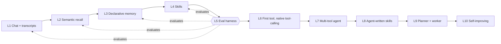

# Understanding how Python LLM apps grow into agents

_One repository, one persistent personal LLM assistant, built in ten phases. pydantic-ai handles the model layer; the application layer (memory, skills, evals, planning, self-improvement) is hand-rolled._

## 01. Intent

> [!TIP] Goal
> Build one public repository (`assistant/`) that grows from a daily-use chat assistant into a self-improving one across an init commit and ten merged feature branches. Each phase teaches one new concept, the assistant is useful to a human (starting with the author) after every merge, and refactoring earlier code as the architecture matures is expected. The throughline is one persistent product, not ten frozen artifacts.
>

> [!NOTE] Non-goals
> - Enterprise-scale production: “production” here means publishable, polished, and useful, not SLA-grade.
>

> [!IMPORTANT] Key insight
> Eval strategy will be the spine of every branch, not an afterthought.
>

## 02. Goals

- **G1 (goal).** Each phase introduces exactly one new technical concept, feature, or agent paradigm the author can articulate and defend in an “Agent Engineer” job interview.
- **G2 (goal).** Each phase produces a working app a human would actually use: not a notebook, not a demo.
- **G3 (goal).** One repo (`assistant/`), one `main` branch. Each capability ships as a feature branch that lands on `main` with tests, eval suite, CHANGELOG entry, and a NOTES.md section explaining the one concept the phase teaches. The repo’s git history is the portfolio artifact. See [ADR-005](#decisions).
- **G4 (goal).** Every phase uses the same stack: pydantic-ai and FastAPI with a hand-rolled application layer.
- **G5 (goal).** Every phase contributes to one growing personal assistant. The Obsidian vault is the memory substrate; tools are added when they earn their place; no phase is a standalone data pipeline.
- **G6 (goal).** Each phase produces output that’s annotatable, supports failure analysis, and can be evaluated without case-by-case expert judgment (following Hamel Husain’s workflow at [hamel.dev](https://hamel.dev)): tasks have verifiable ground truth, rubric-based scoring, or trajectory evals.

## 03. Non-goals

- **NG1 (non-goal).** Framework cargo-culting outside the pydantic-ai adoption. No LangChain, CrewAI, LlamaIndex, OpenAI Agents SDK, or Claude Agent SDK in this curriculum. _(Pydantic-ai is the chosen model abstraction per [ADR-001](#decisions). See [I7](#I7).)_
- **NG2 (non-goal).** A unified frontend across all phases. CLI / TUI / web is per-phase; the Obsidian plugin is the north star, not a deliverable per phase.
- **NG3 (non-goal).** Multi-tenant SaaS shape. One repo, one main branch, one deployment, one user on one machine. Serving many tenants with isolation, billing, and per-tenant config is out of scope.

## 04. Invariants

- **I1 (invariant).** Every phase the assistant reaches has an LLM loop with more than one call. Even phase 1 retries on validation failure (pydantic-ai handles the retry mechanics under the hood per ADR-001).
- **I2 (invariant).** Every phase has some form of memory. The kind varies (in-context, always-loaded AGENTS.md-style, semantic, agent-owned, episodic, procedural) and is the central learning artifact of that phase.
- **I3 (invariant).** Every phase has a FastAPI backend. The frontend is whatever fits (CLI, TUI, or web). The API stays consistent so any future surface (Obsidian plugin, mobile app, hosted web UI) plugs into the same backend.
- **I4 (invariant).** Every phase ships with an eval suite proportional to its complexity: roughly 10–20 labeled fixtures per verifiable behavior at phase 1, scaling to a closed-loop self-evaluator by phase 10.
- **I5 (invariant).** **Trace.** All LLM calls, tool invocations, token counts, costs, and latencies are captured by pydantic-ai’s native instrumentation (Pydantic Logfire, OpenTelemetry-based: `logfire.instrument_pydantic_ai()`). This is the source for annotations, failure analysis, and evals. Logfire cloud to start; because the data is standard OpenTelemetry, moving to a local collector later is a config change. Non-negotiable from phase 1.
- **I6 (invariant).** Every markdown file our agents write to the vault that contains agent-readable instructions is `§Skills-spec compliant`. _(Open question: verify the Skills-spec frontmatter is also Obsidian-compatible so the same file renders cleanly in the vault.)_
- **I7 (invariant).** Pydantic-ai is the only agent framework we import; it owns the model-call layer (per-agent loop, tool dispatch, retries, structured outputs, streaming) per [ADR-001](#decisions). Everything above it is hand-rolled in our repo: memory store, skill catalog, eval harness, skill drafting, planner/worker contract, self-improvement loop. No LangChain, CrewAI, LlamaIndex, OpenAI Agents SDK, or Claude Agent SDK.
- **I8 (invariant).** Writes to external systems (any social-platform or third-party API write a future tool introduces) are scoped to bot or sandbox accounts owned by the author. Reads can be global, subject to platform terms and rate limits. Larger public-figure accounts that opt into bot interaction can be allowlisted; default-deny on writes otherwise. Protects against accidental notification spam to non-consenting users and keeps the portfolio defensible.
- **I9 (invariant).** App code never imports a provider SDK directly. Chat, streaming, and structured-output calls route through pydantic-ai’s `Agent` / `Model` interface (per ADR-001). Embeddings route through the indexer’s provider-agnostic interface (e.g., `chromadb`’s embedding functions). Provider swap is a model-string change in config, not a code change.

## 05. Context

> _The 2026 agent landscape is crowded with frameworks but thin on production references. This plan adopts one framework, pydantic-ai, for the model-call layer and hand-rolls the application layer above it._

The most-studied agent frameworks in Python (LangChain/LangGraph, CrewAI, AutoGen/AG2, smolagents, Agno, DSPy, Strands, Atomic Agents, Haystack, Letta, Pydantic-AI, OpenAI Agents SDK, Claude Agent SDK) share one structural property: their public production rosters thin out fast under verification. LangChain/LangGraph has the deepest (Klarna, Replit, LinkedIn, Elastic). Pydantic-AI has a handful (MindsDB, Sophos, Boosted.ai) but mostly from the vendor’s own case-study page. Letta has Bilt and a few others. The two new agent SDKs (OpenAI Agents, Claude Agent) have _no_ verified third-party shipped products yet. Both are under fourteen months old as public libraries.

Meanwhile, the most respected shipped agentic products (**Claude Code, Cursor, Cognition’s Devin, Cline, Continue, Aider, OpenHands**) are built on the raw provider SDKs with hand-rolled harnesses. Anthropic, Cursor, and Cognition have all published essays explaining the rationale: control over context, debuggability, model-specific tool formats, and (Anthropic’s point) the desire to _delete_ code when new models land.

> [!NOTE] Why this matters for the portfolio
> The marketable skill is judgment about the boundary: delegate the model-call plumbing to pydantic-ai, hand-roll the application layer (memory, skills, evals, planning). The portfolio narrative is “I delegated the boring infrastructure and built the interesting parts.”
>

> [!NOTE] Assumptions
> - OpenAI/OpenRouter pricing on small and medium models stays cheap enough that an author can run hundreds of eval runs per phase without budget pressure.
> - Markdown with YAML frontmatter and wikilink-style cross-references remains a viable substrate for agent-readable memory through the portfolio’s build window. The vault is just a folder of files; if Obsidian itself shifts, the underlying format is portable.
> - The [agentskills.io](https://agentskills.io/specification) spec stays the cross-vendor convergence point for agent skill files.
> - Pydantic-ai remains a maintained, type-safe, model-agnostic library through the portfolio’s build window. It is now a core dependency ([ADR-001](#decisions)).
>

## 06. Design

> _One repo, three macro-phases of merges into `main`. The personal-assistant substrate, the eval pivot, then tools and agents._

_Figure. Figure 1. Ten phases, each landing on main as a feature branch. Phases 1–4 build the personal-assistant substrate (chat, recall, memory, skills). Phase 5 is the eval pivot: it extends eval coverage back over phases 1–4 and stands up the eval harness every later phase builds on. Phases 6–10 are tools and agents grown on top of that substrate. Refactoring earlier code is allowed and expected at any phase._

## 07. Macro-phases

**Phases**

- **Macro-phase 1: Assistant substrate (phases 1–4)** _(active)_
  - Chat, semantic recall, declarative memory, procedural skills
  - Conversation-first; vault as the memory store
  - Main is useful daily after each merge
- **Macro-phase 2: Eval pivot (phase 5)** _(future)_
  - Small hand-built eval harness on top of the traces
  - Extends eval coverage back over phases 1–4
  - Substrate every later phase reads
- **Macro-phase 3: Tools and agents (phases 6–10)** _(future)_
  - Pydantic-ai owns the loop; tool design and tracing is the focus
  - Tools added when the assistant earns them
  - Agent-written skills, long-horizon work, self-improvement

## 08. Development cycle

One repo (`assistant/`), one main branch, one persistent product. The portfolio artifact is the repo’s history: an init commit that scaffolds the assistant, then ten phases, each delivered as a feature branch that adds one capability and merges to main with tests, evals, and a CHANGELOG entry. Anchor IDs (`#l1`…`#l10`) below match the phase numbers so xrefs from invariants and ADRs still resolve.

### Init · `assistant/` scaffolding

**What lands on main.** Pydantic-ai `Agent` with zero tools registered. FastAPI app with one Server-Sent Events chat endpoint. Conversation is in-memory only: chat works within a running process; durable persistence arrives in phase 1. Tracing via pydantic-ai’s Logfire instrumentation, enabled at init; structlog configured for application logging. Provider model-string config (`MODEL=openai:gpt-4o-mini` by default). Vault paths created (`memory/`, `skills/`, `evals/`, `transcripts/`) but unused. ruff + mypy + CI. One smoke test (chat round-trip). One eval fixture format.

**Decisions baked in at init.** ADR-001 (pydantic-ai for the model layer, hand-rolled application layer), ADR-002 (FastAPI), ADR-003 (one growing assistant), ADR-005 (one repo, dev cycle).

**DOD.** Provider abstraction enforced (`§I9`), traces logging (`§I5`), eval fixture loadable, smoke test green.

### Phase 1 · `feat/transcripts`

**Adds.** The first persistence layer. Every completed (or cancelled) turn renders at session end to `vault/transcripts/{date}/{session}.md`. Introduces the `§vault-write primitives` (manifest + staging + provenance markers) for the first time; every later phase that writes to the vault reuses them.

**Tests.** Persistence round-trip (turn → markdown → re-parseable). Cancellation marker (`[cancelled]`) on disconnect.

**Primary analog.** [Azure-Samples/rag-postgres-openai-python](https://github.com/Azure-Samples/rag-postgres-openai-python) for FastAPI + streaming + persistence; [basicmachines-co/basic-memory](https://github.com/basicmachines-co/basic-memory) for the chat-plus-notes persistence shape; [simonw/llm](https://github.com/simonw/llm) for the CLI shape.

**Merge.** Main has browsable transcripts.

### Phase 2 · `feat/semantic-recall`

**Adds.** Embedding index (`chromadb` or `sqlite-vec`) over completed turns plus a BM25 lexical index alongside. Pre-turn retrieval injects top-k (3–5) relevant past exchanges into the system prompt for that turn only. Chunking is per turn at first cut (one user message + assistant response = one chunk); per-topic clustering deferred. Index persisted alongside session data, outside the vault. Embeddings route through the indexer’s own provider-agnostic interface (chromadb embedding functions), not through pydantic-ai.

**Tests.** Recall@k and MRR on bootstrapped (query → expected past-exchange) pairs sampled from your own history. Faithfulness when retrieved context is summarized into the response.

**Primary analog.** [benmaster82/Kwipu](https://github.com/benmaster82/Kwipu) for the hybrid-retrieval shape. [basic-memory](https://github.com/basicmachines-co/basic-memory) for the conversation-as-corpus shape.

**Merge.** Main remembers what you talked about.

### Phase 3 · `feat/declarative-memory`

**Adds.** Markdown files in `vault/memory/` always-loaded as part of the Agent’s system prompt under a token budget (default ~1000 tokens; older facts age out into a searchable not-always-loaded tier). Background fact extraction via `direct.model_request` after each turn (non-blocking; the next turn sees updates). Contradiction detection at write time via embedding similarity, resolved by superseding with citation to the contradicting exchange.

**Tests.** Planted-fact recall across sessions. Contradiction resolution with citation. Token budget enforced.

**Primary analog.** [cline/cline](https://github.com/cline/cline) Memory Bank pattern (`.clinerules/` as always-loaded procedural memory). Anthropic’s own `AGENTS.md` / `CLAUDE.md` convention as the canonical shape. [Ar9av/obsidian-wiki](https://github.com/Ar9av/obsidian-wiki) for vault conventions (manifest, `hot.md`, staging, provenance markers).

**Merge.** Main knows you between sessions.

### Phase 4 · `feat/skills`

**Adds.** `SKILL.md` files in `vault/skills/` with agentskills.io frontmatter (`name`, `description`); provenance rides in the spec’s client-key escape hatch as `metadata.source` (user-written vs agent-written). Match-on-input is description-driven, as the spec intends: embedding similarity between the user’s turn and each skill’s `description`, which catches rephrasings a keyword list would miss. Matched skills inject into the Agent’s system prompt in priority order, capped by a token budget. Watchdog-watched directory; new skills picked up without restart. `§Progressive disclosure`: skill bodies plus optional `references/` and `scripts/` loaded only when the workflow points to them. User-edited and (later) agent-written skills coexist; `metadata.source` distinguishes them.

**Tests.** Skill-match precision (did the right skill load for the query?). Skill-following adherence (did the response follow the skill’s steps?).

**Primary analog.** [kepano/obsidian-skills](https://github.com/kepano/obsidian-skills): format target. Anthropic Agent Skills as the canonical schema. [cline/cline](https://github.com/cline/cline) Memory Bank for the procedural-memory shape.

**Merge.** Main has opinions about recurring tasks.

### Phase 5 · `feat/eval-harness` · _the pivot_

**Adds.** CLI plus library that loads per-intent fixture datasets (in `vault/evals/{phase}/` as markdown with frontmatter), runs each capability against its fixtures on current `main`, scores via `direct.model_request` judge calls, and writes eval results with rollups per fixture, bucket, and skill. Comparison view in `rich`: prompt-version A vs B, model X vs Y, skill-version v1 vs v2. Diskcache-backed judge cache prevents cost explosions across re-runs. Phases 1–4 are scored by adding their fixture buckets and running them against current `main`: “retroactive” means extending eval coverage back over earlier capabilities, not reproducing historical behavior. Each capability stays importable as a package so the harness can invoke it directly.

**Tests.** This phase _is_ the eval. Validation: judge-human agreement on a held-out slice of 30–50 spot-checked examples per judge (smaller slices give error bars too wide to trust).

**Primary analog.** [meshkovQA/Eval-ai-library](https://github.com/meshkovQA/Eval-ai-library) for size and shape. Read [openai/evals](https://github.com/openai/evals) for the YAML + grader pattern but don’t template (too big). [ragas](https://github.com/explodinggradients/ragas) for chat-specific metrics applied to phases 1–2.

**Merge.** Main can be tuned against itself.

### Phase 6 · `feat/first-tool`

**Adds.** First `@agent.tool` registered with the pydantic-ai Agent. Function is `fetch_url(url: str) -> str` (or `web_search(q) -> list[Result]`); choice driven by what phases 1–5 trace data shows you most often want to outsource. Pydantic-ai auto-generates the JSON schema from the typed signature. Tools receive a pydantic-ai `RunContext` carrying shared dependencies (config, clients). Tool errors surface to the Agent as result content; the Agent decides retry, clarify, or give up. Every invocation traced (args, return, latency, cost). The interesting work is tool design and tracing, not the loop (pydantic-ai handles that).

**Tests.** Trajectory grading (right tool, right args, right number of iterations). Task success on a small fetch-or-search dataset.

**Primary analog.** [simonw/llm](https://github.com/simonw/llm)’s `_tools.py` as the battle-tested reference. [gptme/gptme](https://github.com/gptme/gptme) for the loop shape (kept as a comparison artifact even though pydantic-ai now owns the loop).

**Merge.** Main can reach outside the conversation.

### Phase 7 · `feat/multi-tool-routing`

**Adds.** Several tools registered (`fetch_url`, `web_search`, `vault_search`, `current_time`, and read-only Bluesky tools `bsky_search` and `bsky_get_thread` via the `atproto` client and the `getPostThreadV2` lexicon, plus one or two others chosen from what phases 1–6 traces show you actually wanted to outsource). System prompt explicitly tells the Agent to consult memory (`§phase 3`) and skills (`§phase 4`) _before_ calling tools. Memory and skills also exposed as tools the Agent can invoke on demand. Per-turn budget (max N tool calls, max wall-clock seconds) caps runaway loops. Parallel tool calls handled by pydantic-ai. Tool cost tracked alongside model cost in the traces.

**Tests.** Trajectory at higher cardinality (did it skip tools it didn’t need?). Task success on multi-tool tasks. Token efficiency: did memory and skills suppress unnecessary tool calls?

**Primary analog.** [gptme/gptme](https://github.com/gptme/gptme) (multi-tool loop). [NirDiamant/Agent_Memory_Techniques](https://github.com/NirDiamant/Agent_Memory_Techniques) for memory-aware tool routing patterns.

**Merge.** Main is a real assistant.

### Phase 8 · `feat/skill-drafter`

**Adds.** Scheduled job (`assistant skills draft`, also cron-runnable) that mines recent traces for repeated request patterns lacking matching skills. Pattern discovery is an aggregation step, not a single LLM call: embed the request turns and cluster them (embedding clusters, or frequent-itemset over tool/intent sequences), then surface clusters above a frequency threshold. Only then does a `direct.model_request` draft a `SKILL.md` per cluster, returning a typed `SkillDraft` Pydantic model into `vault/skills/_staging/`. Drafts carry the source trace IDs for human auditing. A review CLI (`assistant skills review`) promotes drafts into `vault/skills/`. Promotion is human-gated at this phase; `§phase 10` is when promotion becomes self-directed.

> [!NOTE] Framing correction
> Ar9av/obsidian-wiki and kepano/obsidian-skills are _not_ Python agent frameworks: they’re markdown-only skill collections that run on Claude Code/Cursor/Codex. We borrow their conventions; we don’t port them. The drafting Agent is original code on pydantic-ai.
>

**Tests.** Draft quality (do agent-drafted skills pass the phase-4 skill-following metric?). Acceptance rate (drafts approved / drafts proposed).

**Primary analog.** [cline/cline](https://github.com/cline/cline) Memory Bank (`.clinerules/` written by the agent). [breferrari/obsidian-mind](https://github.com/breferrari/obsidian-mind) for vault templates. [kepano/obsidian-skills](https://github.com/kepano/obsidian-skills) as the format target.

**Merge.** Main proposes improvements to itself.

### Phase 9 · `feat/planner-worker`

**Adds.** Two pydantic-ai Agents in a structured contract. The planner is read-only (a tool whitelist enforces it) and emits a typed `Plan`: a list of steps, each naming a worker action plus its expected outcome. The worker executes one step at a time and returns structured results; the planner re-plans after observing them. The read-only/read-write split is the point: the planner holds no write tools, so a bad plan costs nothing until the worker acts on it. The handoff is a typed `Plan` object, not a shared transcript. Long-horizon tasks checkpoint their progress (mechanism deferred) and resume on crash.

**Tests.** Task success on held-out long-horizon tasks (planted vault setups with known orphans; planted multi-step research tasks). Trajectory: did the planner stay read-only, and did the worker follow the plan?

**Primary analog.** [sst/opencode](https://github.com/sst/opencode) for the cleanest open `plan`/`build` split. [SWE-agent](https://github.com/SWE-agent/SWE-agent) mini variant (~100 LOC) for the academic-clean planner→tool loop.

**First named use cases.** “Build me a Bluesky dossier on @karpathy.” Or: “Audit my vault for orphan notes and propose links across hundreds of files in one pass.”

**Merge.** Main can take all-afternoon tasks.

### Phase 10 · `feat/self-improving`

**Adds.** Meta-Agent reads the trace history, clusters skill-following failures via a `direct.model_request` returning typed cluster descriptors, and runs [DSPy](https://github.com/stanfordnlp/dspy)’s GEPA optimizer over the affected `SKILL.md` bodies. Candidate skill versions land in `vault/skills/_proposed/`. Auto-promotion when a held-out eval slice clears a conservative, pre-registered threshold; failures auto-revert. The slice size and effect threshold are fixed when phase 5’s eval suite is built, with the slice large enough that the threshold is statistically meaningful. Runs on a configurable schedule (default weekly). The user-gated drafter from `§phase 8` stays as the discovery counterpart to this phase’s auto-gated optimization.

**Tests.** Meta-eval: does the agent’s self-improvement actually improve held-out task performance? Spearman ρ on a held-out set.

**Primary analog.** [NousResearch/hermes-agent](https://github.com/NousResearch/hermes-agent), a shipped assistant with a built-in learning loop, is the closest whole-trajectory analog; its [hermes-agent-self-evolution](https://github.com/NousResearch/hermes-agent-self-evolution) component is the direct architecture match for this phase. Engine: [stanfordnlp/dspy](https://github.com/stanfordnlp/dspy) GEPA optimizer over the skill markdown files. Fallback: [EvoAgentX/EvoAgentX](https://github.com/EvoAgentX/EvoAgentX).

> [!NOTE] Known wrinkle
> This phase has no clean single-developer analog (hermes-agent is a funded team’s product). Ship as a capstone phase with a thinner code surface than phases 8 or 9. ~50% blog post, 50% code.
>

**Merge.** Main improves on its own.

## 09. Decisions

### ADR-001: Adopt pydantic-ai for the model layer; hand-roll the application layer

_Status: approved_

**Context.** An agent product splits into a model-call layer (loop, tool dispatch, retries, structured output, streaming) and an application layer (memory, skills, evals, planning, self-improvement). The model-call layer is solved; the application layer is where the defensible engineering is.

**Decision.** Pydantic-ai owns the model-call layer. App code uses pydantic-ai’s `Agent` / `Model` types and Pydantic result types; it never imports a provider SDK directly. The provider and model are a config string (e.g. `openai:gpt-4o-mini`); provider choice is a config/runtime detail, not an architecture decision. The application layer is hand-rolled in this repo: memory store, skill catalog, eval harness, skill drafting, planner/worker contract, self-improvement loop. No LangChain, CrewAI, LlamaIndex, OpenAI Agents SDK, or Claude Agent SDK.

**Consequences.** The hand-rolled work concentrates where the interesting design lives; no time is spent reimplementing a ReAct loop or tool-call parsing. Type safety throughout (Pydantic-native result types). Provider portability is config. One framework dependency, scoped to exactly this seam. Embeddings route through the indexer’s own provider-agnostic interface (e.g. `chromadb`’s embedding functions), not through pydantic-ai.

- **Alternatives:** Adopt a full agent framework end to end (LangGraph, CrewAI, OpenAI Agents SDK) and hand-roll nothing; hand-roll everything including the model-call layer on a raw provider SDK; a thin in-repo app.provider.LLM wrapper (more glue code, no community-tested provider parity)
- **Owner:** Scott

### ADR-002: FastAPI backend on every phase; frontend varies

_Status: approved_

**Context.** The eventual goal is an Obsidian plugin. Obsidian plugins are TypeScript but consume HTTP services.

**Decision.** Every phase exposes a FastAPI backend with a stable API contract. The frontend is per-phase (CLI/TUI/web); an Obsidian plugin can be wired on top of any phase.

**Consequences.** Slight overhead at init; clean integration story; every phase is consumable from the same Obsidian plugin once written.

- **Alternatives:** CLI-only (no API); separate plugin per phase
- **Owner:** Scott

### ADR-003: Anchor every phase in building one growing personal assistant

_Status: approved_

**Context.** We need a unifying theme across ten phases that absorbs the breadth of the curriculum (chat, memory, skills, evals, tools, agents) without contortion. We considered three framings: general-purpose-each-app, PKM-anchored-vault, and conversation-anchored-assistant. The strongest analogs we studied (gptme, simonw/llm, Cline, Claude Code itself) are personal assistants that grew capabilities over time, not pipelines over corpora.

**Decision.** Every phase contributes to one growing personal assistant. The assistant talks to the user (phases `§1`–`§2`), learns about the user (phase `§3`), develops skills for the user’s recurring tasks (phase `§4`), is graded on its work (phase `§5`), gains tools when the conversation demands them (phases `§6`–`§7`), proposes its own new skills (phase `§8`), takes on long-horizon work (phase `§9`), and improves itself over time (phase `§10`). The Obsidian vault is the memory substrate where everything the assistant knows lives. External surfaces (Bluesky, web, calendars) are _tools the assistant earns_, not the foundational substrate.

**Consequences.** Phases feel like one product family (the assistant grew). Each phase is immediately personally useful (phase 1 alone is a chat tool you use daily; phase 4 is a personalized agent before any tool fires). External-integration risk is bounded: if Bluesky or any other tool turns out to be the wrong fit at phase 9, it gets swapped without disturbing phases 1–8. The Obsidian-plugin SaaS direction stays credible: the assistant is exactly the kind of thing PKM users want as a plugin, but the assistant is the product, not the plugin.

- **Alternatives:** General-purpose framing (each phase is its own product); PKM-anchored (vault content is the source data); data-pipeline (ingest a corpus per phase)
- **Owner:** Scott

### ADR-004: Skills-spec compliance from day one

_Status: approved_

**Context.** The [agentskills.io](https://agentskills.io/specification) spec is the cross-vendor convergence point (Claude Code, Codex CLI, OpenCode, Cursor). Anything we write to the vault as instructions for an agent has a canonical format.

**Decision.** Markdown files our agents write to the vault that contain agent-readable instructions follow the SKILL.md frontmatter spec. Our own agent reads them too.

**Consequences.** Same vault is consumable by our agent and by Claude Code/Cursor/Codex: free portfolio multiplier. Locks in some frontmatter shape early.

- **Alternatives:** Bespoke frontmatter; no skills at all
- **Owner:** Scott

### ADR-005: One repo, one main branch, dev-cycle progression

_Status: approved_

**Context.** A portfolio of capabilities can ship as separate frozen repos or as one evolving repo. Building a single persistent assistant means earlier code is refactored as the architecture matures; ten frozen artifacts cannot answer “what does the latest version of the assistant look like?” with a single URL.

**Decision.** One repository (`assistant/`), one `main` branch, ten feature branches landed in sequence. Each feature branch delivers one phase, ships with tests + eval suite + CHANGELOG entry + NOTES.md addition, and merges to main. The repo’s git history (PR chain, tagged releases, CHANGELOG) is the portfolio artifact. Refactoring earlier code as the architecture matures is expected; later phases may revise scaffolding from earlier phases.

**Consequences.** The portfolio reads as one growing product instead of a curriculum of toys. Continuous maintenance of earlier code is expected, not avoided. The DOD checklist is per-phase (CHANGELOG entry, NOTES section, eval suite update) rather than per-repo (README, license, CI). The init commit absorbs the scaffolding work (FastAPI, pydantic-ai, Logfire instrumentation, structlog, provider config) that would otherwise have been redrawn ten times.

- **Alternatives:** Ten standalone repos, one per capability (cannot show the latest assistant at one URL; no shared refactoring); monorepo with per-phase subfolders (introduces sub-project boundaries that don’t earn their complexity); release branches per capability (more git ceremony than needed for a single-author project)
- **Owner:** Scott

## 10. Cross-cutting patterns

> _Patterns that surfaced across the analog research and become load-bearing structures of the portfolio: designed once, reused across phases. These are application-layer patterns; the model-call loop is pydantic-ai’s job._

### Memory-as-files

The dominant memory pattern for code agents in 2026 (cline Memory Bank, kepano skills, obsidian-mind). The vault _is_ the memory. The assistant reads markdown on session start, writes markdown when it learns something, and amends markdown when facts change. No database needed for the long-term tier. Procedural memory equals a markdown playbook. Central to Phase `§3`, Phase `§4`, and Phase `§8`.

### Conversation-as-corpus

The assistant’s growing chat history is itself the retrievable corpus for Phase `§2`. No external dataset needed; the substrate is whatever you’ve actually talked about. Same retrieval primitives (embeddings + BM25 + recency) that a PKM tool would apply to external documents now apply to your own past exchanges.

### Plan/build agent split

Two-role pattern in [opencode](https://github.com/sst/opencode) (`plan`/`build`), Aider (architect/editor), SWE-agent. One agent reads-and-proposes, another applies edits. The split is a safety boundary: the planner holds no write tools, so a bad plan costs nothing until the worker acts on it. We accept the cost the split adds (a typed handoff between two agents) for that boundary. Used at Phase `§9`.

### Vault-write primitives (introduced in phase 1, reused forever)

Three primitives lifted from Ar9av’s conventions, designed once in phase 1’s vault-write layer for session transcripts and reused for every subsequent kind of write (memory updates, skill drafts, dossier sections):

- **Manifest with SHA-256 content-hash delta tracking**: skip re-write on hash match.
- **Staging directory + `.patch.md` files**: agent proposes diffs against existing pages, never blind-overwrites.
- **Provenance markers** (`^[inferred]`, `^[ambiguous]`) plus `provenance:` frontmatter ratios. These distinguish what the assistant knows directly from what it inferred.

One more constraint at this layer: foreground chat and background jobs (fact extraction in phase 3, skill drafting in phase 8, self-improvement in phase 10) all write the vault. Writes serialize through a single writer (a lock or a write queue) and land via atomic rename, so no two writers touch the same file at once.

### Three-tier structured-output retry (kytmanov)

Tier 1: native structured outputs. Tier 2: regex extraction from a fenced block. Tier 3: retry with prior validation error embedded in the prompt. Treats the model as a self-correcting compiler. First used at Phase `§4` (validating skill frontmatter on load) and Phase `§6` (parsing tool-call JSON); reused wherever schema validation fails downstream.

### Skills-spec progressive disclosure (Anthropic)

Three load levels: (1) `name` + `description` always in context (~100 tok/skill); (2) body loaded on match; (3) `references/` and `scripts/` loaded only when the workflow points to them. We mirror this for our own assistant’s skill catalog from Phase `§4` onward; agent-written skills at Phase `§8` follow the same shape.

## 11. Eval strategy: solving the no-SME problem

> _Without a domain expert to grade outputs, evaluations must be deterministic, judged-by-rubric, or trajectory-based._

Three reusable strategies the portfolio mixes per phase:

1. **Verifiable domains.** Tasks where correctness is mechanical: stream-cancel correctness, persistence round-trip, retrieval (labeled past-exchange found?), planted-fact recall, skill-match precision, schema validation. Phase `§1` persistence, phase `§2` retrieval, phase `§3` memory probes, phase `§4` skill match, phase `§9` task outcomes use this.
2. **LLM-as-judge with rubrics.** Works when the rubric is tight enough that two judges agree. Validate by sampling and self-checking. Phase `§1` multi-turn coherence, phase `§2` faithfulness, phase `§4` skill-following adherence, phase `§8` agent-drafted skill quality.
3. **Trajectory evals.** Score the path, not just the answer: right tool, right order, right args, right number of iterations, unnecessary calls skipped. Catches regressions when outputs look fine. Phase `§6` onward.

> [!NOTE] Why phase 5 lives where it does
> The eval harness sits at the pivot because phases 1–4 can be graded deterministically: the easy way to learn how evals work. By phase 6 the outputs are too open-ended for pure determinism, and we need the eval muscle already trained. Building it after phase 4 is the cheapest possible eval education.
>

## 12. Risks

| Risk | Severity | Likelihood | Mitigation |
|---|---|---|---|
| Scope creep: “production” quality gets confused with enterprise quality; phases drag on. | High | Likely | Strict definition-of-done per phase. Ship at “good enough for a public repo”, not “deployable to paying customers.” |
| Phase 10 has no production analog and may become an indefinite research project. | Medium | Likely | Time-box at two weeks. If the loop doesn’t close, ship as a writeup-heavy capstone rather than full code. |
| Eval costs balloon when phase 5 retro-applies to phases 1–4. | Medium | Possible | Cache LLM-as-judge calls aggressively (diskcache); use small models for judging where feasible. |
| Memory accumulation drift: after months of conversations the phase-3 declarative store goes stale or self-contradicts. | Medium | Likely | Phase 3 includes contradiction-on-update logic (newer facts override older with citation). Phase 5 grades memory recency and consistency as part of routine eval runs. |
| User-as-only-tester limitation: the author is the only daily user, so eval coverage skews to one person’s patterns. | Medium | Possible | Phase 5 fixtures include synthesized chat sessions across distinct user personas. Invite at least one external user by phase 4 to widen the trace surface. |
| Markdown / vault format assumptions break (Obsidian Bases spec, frontmatter conventions, wikilink semantics). | Low | Possible | Pin to agentskills.io spec where applicable. Vault is plain files; Obsidian-specific surface is a thin adapter, not core code. |
| Refactor-creep on earlier phases: each new phase’s “allowed and expected” refactoring of earlier code expands until shipping the new capability stalls. | Medium | Likely | Refactor budget per phase (rough wall-clock cap; e.g., max one day of refactoring vs the new capability). CHANGELOG entries call out incidental refactors so they’re visible in review. If the refactor wants to be bigger, it becomes its own branch. |
| Eval-fixture drift: as later phases change behavior, an early fixture (e.g., a phase-2 retrieval fixture expecting a recall answer) silently stops applying once a tool satisfies the same query. | Medium | Likely | Per-phase fixture-maintenance budget, parallel to the refactor budget: each phase re-baselines the fixtures its changes invalidate. Drifted fixtures are fixed or retired, never left silently failing. |
| Prior art: NousResearch/hermes-agent, a shipped product, already implements roughly this phase 1–10 trajectory. | Low | Certain | The portfolio is a learning artifact and an interview credential, not a competing product. Cite hermes-agent as prior art and study its architecture; the value is the documented build and the author’s ability to defend every decision, not novelty. |

## 13. Acceptance: definition of done

Two DOD checklists. The _init_ commit must clear the repo-level list once. Every _phase_ must clear the per-phase list before its feature branch merges to `main`.

### Init (one-time, repo scaffolding)

- [ ] Public GitHub repo assistant/, MIT-licensed, README with vision + install + first chat _(scott · -)_
- [ ] Single pyproject.toml with locked deps via uv; Python version pinned _(scott · -)_
- [ ] Ruff + mypy clean; CI smoke test on push _(scott · -)_
- [ ] Configuration via .env + pydantic-settings; .env.example committed _(scott · -)_
- [ ] FastAPI backend with OpenAPI spec at /docs _(scott · -)_
- [ ] All chat / streaming / structured-output calls route through pydantic-ai’s Agent / Model (no direct provider-SDK imports in app code) per ADR-001 _(scott · -)_
- [ ] LLM calls and tool invocations traced via pydantic-ai’s Logfire instrumentation per I5 _(scott · -)_
- [ ] CHANGELOG.md and NOTES.md present; one entry each for the init commit _(scott · -)_

### Per phase (every `feat/*` merge)

- [ ] Capability behaves end-to-end against the real chat surface (not just unit tests) _(scott · -)_
- [ ] New tests added; CI green on the branch _(scott · -)_
- [ ] Eval suite extended with at least one fixture-bucket / scenario that exercises the new capability _(scott · -)_
- [ ] CHANGELOG entry under a new ## [unreleased] heading; promoted to a version on merge _(scott · -)_
- [ ] NOTES.md gets a section: the one concept this phase teaches, with code-pointer references _(scott · -)_
- [ ] No regression in earlier capabilities (full eval suite still passes); refactors to earlier code allowed and expected per ADR-005 _(scott · -)_

## 14. References

Analog repos studied, plus primary sources for the patterns.

### Cloned and read

- [Ar9av/obsidian-wiki](https://github.com/Ar9av/obsidian-wiki): **markdown-only skill collection, NOT a Python agent framework.** Vault-as-memory conventions: manifest, `hot.md`, staging, provenance markers. _Conventions reference for phase 3 declarative memory and beyond._
- [kepano/obsidian-skills](https://github.com/kepano/obsidian-skills): Obsidian CEO’s official skill bundle. Format target for our assistant’s vault-stored playbooks. _Schema reference for phase 4 and phase 8._
- [kytmanov/obsidian-llm-wiki-local](https://github.com/kytmanov/obsidian-llm-wiki-local): three-tier structured-output retry; fill-in example trees instead of JSON Schema. _Pattern reference, not a phase-1 analog. Used wherever schema validation happens (phase 4 skill load, phase 6 tool-call parsing)._
- [NousResearch/hermes-agent](https://github.com/NousResearch/hermes-agent): a shipped personal assistant with a built-in learning loop: it creates skills from experience, improves them in use, searches its own past conversations, and builds a model of the user across sessions. _The closest whole-trajectory prior art to this portfolio; read its architecture before phase 1._

### Verified GitHub analogs (active May 2026, >10 stars)

- **Phase 1** · [Azure-Samples/rag-postgres-openai-python](https://github.com/Azure-Samples/rag-postgres-openai-python) (490 stars) · [basic-memory](https://github.com/basicmachines-co/basic-memory) (3k stars) · [simonw/llm](https://github.com/simonw/llm) (12k stars, CLI shape)
- **Phase 2** · [benmaster82/Kwipu](https://github.com/benmaster82/Kwipu) (80 stars) · [basic-memory](https://github.com/basicmachines-co/basic-memory) (3k stars) · [ObsidianRAG](https://github.com/Vasallo94/ObsidianRAG) (79 stars)
- **Phase 3** · [cline](https://github.com/cline/cline) (61k stars, Memory Bank) · [Ar9av/obsidian-wiki](https://github.com/Ar9av/obsidian-wiki) (1.4k stars, vault conventions)
- **Phase 4** · [kepano/obsidian-skills](https://github.com/kepano/obsidian-skills) (32k stars, format target) · [cline](https://github.com/cline/cline) (procedural memory shape)
- **Phase 5** · [meshkovQA/Eval-ai-library](https://github.com/meshkovQA/Eval-ai-library) (44 stars) · [openai/evals](https://github.com/openai/evals) (18k stars, read but don’t template) · [ragas](https://github.com/explodinggradients/ragas) (14k stars)
- **Phase 6** · [simonw/llm](https://github.com/simonw/llm) (12k stars, `_tools.py`) · [gptme](https://github.com/gptme/gptme) (4.3k stars, loop shape)
- **Phase 7** · [gptme](https://github.com/gptme/gptme) (multi-tool loop) · [Agent_Memory_Techniques](https://github.com/NirDiamant/Agent_Memory_Techniques) (378 stars, memory-aware routing)
- **Phase 8** · [cline](https://github.com/cline/cline) (Memory Bank written by the agent) · [obsidian-mind](https://github.com/breferrari/obsidian-mind) (2.6k stars, vault template) · [kepano/obsidian-skills](https://github.com/kepano/obsidian-skills)
- **Phase 9** · [sst/opencode](https://github.com/sst/opencode) (161k stars) · [SWE-agent](https://github.com/SWE-agent/SWE-agent) (19k stars) · [OpenHands](https://github.com/All-Hands-AI/OpenHands) (70k stars)
- **Phase 10** · [hermes-agent](https://github.com/NousResearch/hermes-agent) (whole-trajectory analog) · [hermes-agent-self-evolution](https://github.com/NousResearch/hermes-agent-self-evolution) (3.4k stars) · [DSPy](https://github.com/stanfordnlp/dspy) (34k stars) · [EvoAgentX](https://github.com/EvoAgentX/EvoAgentX) (3k stars)

### Primary sources

- [agentskills.io spec](https://agentskills.io/specification) _(canonical Skills format)_
- [Anthropic, Equipping agents with Agent Skills](https://www.anthropic.com/engineering/equipping-agents-for-the-real-world-with-agent-skills) _(rationale)_
- [Anthropic docs, Agent Skills overview](https://platform.claude.com/docs/en/docs/agents-and-tools/agent-skills/overview) _(three-level loading model)_
- [Octomind, Why we no longer use LangChain](https://www.octomind.dev/blog/why-we-no-longer-use-langchain-for-building-our-ai-agents) _(why LangChain’s abstractions backfired; grounds NG2)_
- [Pragmatic Engineer, How Claude Code is built](https://newsletter.pragmaticengineer.com/p/how-claude-code-is-built) _(“every model release, we delete code”)_
- [Cursor, Continually improving our agent harness](https://cursor.com/blog/continually-improving-agent-harness) _(model-specific tool formats)_
